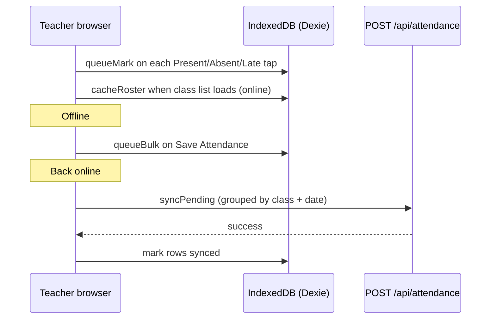

# Offline attendance guide

Rural schools often lose connectivity during the school day. ZSMS lets teachers **mark attendance on the web dashboard without a live connection**. Marks are stored on the device and synced to the server when the network returns.

## How it works



1. Teacher opens **Dashboard → Attendance** (`/dashboard/attendance`).
2. Each status change is written to **IndexedDB** immediately.
3. **Save Attendance** queues all rows and tries the API; if offline, only local storage runs.
4. When `navigator.onLine` is true, **`syncPending()`** runs automatically (on reconnect and every 30 seconds).
5. **Sync status badge** in the page header shows Online / Offline / pending count.

## Local data (Dexie schema)

Database name: `zsms_offline`

| Store             | Purpose                                                                           |
| ----------------- | --------------------------------------------------------------------------------- |
| `attendanceQueue` | Unsynced marks (`studentId`, `classId`, `date`, `status`, `synced`, `retryCount`) |
| `classRosters`    | Cached student list per class for offline display                                 |
| `syncLog`         | Last sync attempts (debugging)                                                    |

Implementation: [`lib/offline/attendance-store.js`](../lib/offline/attendance-store.js)

## Sync behaviour

- **Automatic:** `useOfflineSync` listens for `online` and polls every 30s while online.
- **Manual:** Tap the amber badge (“N not synced — tap to sync”).
- **API:** `POST /api/attendance` with `{ date, records: [{ studentId, status }] }` and `source: 'offline-sync'`.
- **Grouping:** Pending marks for the same class and date are sent in one request.

## If sync fails

- HTTP errors increment `retryCount` and store `lastError` on the row.
- Rows stay in the queue until a later sync succeeds.
- Teacher can keep marking offline; duplicates for the same student/class/date are replaced in the queue.

## Browser support

Requires **IndexedDB** (all modern mobile browsers: Chrome Android, Safari iOS 10+, Firefox).

Dexie is already a project dependency (`dexie` ^4).

## Limitations

- Data is **per device** — marks on a phone do not appear on a laptop until synced to the server.
- Cached rosters are only as fresh as the last online load of that class.
- Session-based QR attendance uses a separate flow (`/attend`); this guide covers the **class register** at `/dashboard/attendance`.
- The legacy `lib/offlineSystem.js` is unrelated; use `lib/offline/attendance-store.js` for attendance.

## For developers

```javascript
import { attendanceStore } from '@/lib/offline/attendance-store'
import { useOfflineSync } from '@/lib/offline/use-sync'
import { SyncStatusBadge } from '@/components/attendance/SyncStatusBadge'

await attendanceStore.queueMark({ studentId, classId, date, status: 'present' })
await attendanceStore.cacheRoster(classId, schoolId, students)
const { syncNow, pendingCount } = useOfflineSync()
```

Tests: [`__tests__/unit/offline-attendance.test.js`](../__tests__/unit/offline-attendance.test.js)
