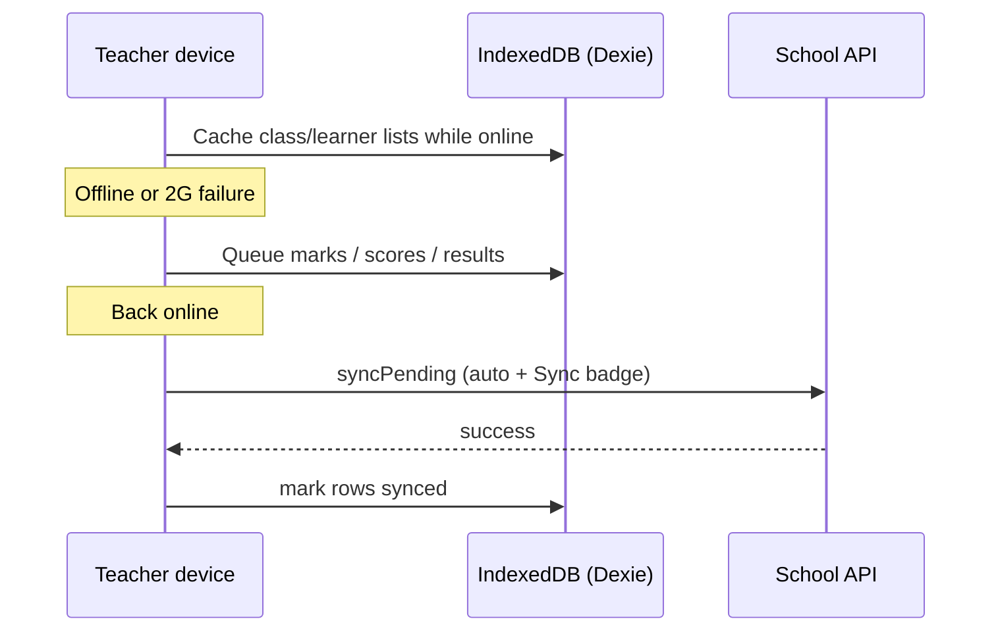

# Offline guide (attendance + teacher results)

Rural schools often have **2G, intermittent, or no connectivity** during the day. ZSMS is a Progressive Web App (PWA) that lets teachers keep working on the device and sync when the network returns.

## What works offline today

| Workflow               | Page                                 | Local store                       | Sync API                           |
| ---------------------- | ------------------------------------ | --------------------------------- | ---------------------------------- |
| Class attendance       | `/dashboard/attendance`              | IndexedDB `attendanceQueue`       | `POST /api/attendance`             |
| Secondary Result Entry | `/dashboard/teacher/results`         | IndexedDB `gradebookQueue`        | `POST /api/teacher/results`        |
| ECZ SBA scores         | `/dashboard/teacher/assessments/ecz` | IndexedDB `sbaScoreQueue`         | `POST /api/assessments/sba-scores` |
| Mobile SBA scores      | Expo Scores tab                      | AsyncStorage → `/api/mobile/sync` | See mobile docs                    |

**Install tip:** Open the school site on Chrome/Safari once while online, use **Add to Home Screen**, then reopen Result Entry / ECZ SBA / Attendance so the service worker can cache those shells.

## How it works


```mermaid
sequenceDiagram
  participant T as Teacher device
  participant IDB as IndexedDB (Dexie)
  participant API as School API

  T->>IDB: Cache class/learner lists while online
  Note over T: Offline or 2G failure
  T->>IDB: Queue marks / scores / results
  Note over T: Back online
  T->>API: syncPending (auto + Sync badge)
  API-->>T: success
  T->>IDB: mark rows synced
```

1. Teacher opens the page **while online at least once** (loads class lists / tasks).
2. Edits are written to **IndexedDB** when offline, on timeout, or on weak connections.
3. When `navigator.onLine` is true, sync runs on reconnect and about every 30 seconds.
4. The **Sync status badge** shows Online / Offline / pending count.

## Local data (Dexie schema)

Database name: `zsms_offline`

| Store             | Purpose                                       |
| ----------------- | --------------------------------------------- |
| `attendanceQueue` | Unsynced attendance marks                     |
| `classRosters`    | Cached student list per class                 |
| `sbaScoreQueue`   | Unsynced ECZ SBA score POSTs                  |
| `gradebookQueue`  | Unsynced secondary Result Entry batches       |
| `resultsCache`    | Cached assignments, pupils, SBA learner lists |
| `syncLog`         | Last sync attempts (debugging)                |

Implementation:

- [`lib/offline/db.js`](../lib/offline/db.js)
- [`lib/offline/attendance-store.js`](../lib/offline/attendance-store.js)
- [`lib/offline/results-store.js`](../lib/offline/results-store.js)
- [`lib/offline/use-sync.js`](../lib/offline/use-sync.js)
- Service worker: [`public/sw.js`](../public/sw.js) (caches teacher page shells after online visits)

## Attendance (summary)

1. Open **Dashboard → Attendance**.
2. Status changes queue immediately; **Save Attendance** also queues.
3. Manual sync: amber badge (“N not synced — tap to sync”).

## Result Entry (secondary)

1. Open **Result Entry** (`/dashboard/teacher/results`) online once to load teaching assignments and class lists.
2. Enter scores and tap **Save** — works offline or on timeout (queued in IndexedDB).
3. Legacy `localStorage` queues (`gradebook_queue_v1*`) migrate automatically into IndexedDB.
4. Tap **Sync** or wait for reconnect; conflicts (409) still show the conflict UI.

## ECZ SBA scores

1. Open **ECZ SBA Hub** online once so tasks and learner lists cache.
2. Use **Record SBA score** or **Tracking sheet** — offline/network failures queue to IndexedDB.
3. Sync badge flushes to `/api/assessments/sba-scores` when online.

Creating brand-new SBA tasks, seeding subjects, or exporting ECZ CSV still needs a live connection.

## PWA / 2G behaviour

- **Installable** via `manifest.json` + service worker.
- Static assets: cache-first.
- Teacher shells (results, SBA hub, attendance): network-first, **fallback to last cached page** when offline.
- Writes never rely on the service worker — they use IndexedDB queues so marks are not lost if the HTML shell is stale.
- **Zero internet:** teachers can keep entering on a previously opened/installed session; data stays on the device until sync.

## If sync fails

- Retries increment `retryCount` and store `lastError`.
- Permanent 4xx SBA rows are marked dropped so the queue does not loop forever.
- Gradebook 409 conflicts pause flush until the teacher resolves them in the UI.
- Data is **per device** until synced.

## Browser support

Requires **IndexedDB** (Chrome Android, Safari iOS 10+, Firefox, Edge).

## For developers

```javascript
import { attendanceStore } from '@/lib/offline/attendance-store'
import { resultsStore } from '@/lib/offline/results-store'
import { useOfflineSync } from '@/lib/offline/use-sync'
import { SyncStatusBadge } from '@/components/attendance/SyncStatusBadge'

await resultsStore.queueSbaScore({ assessmentId, studentId, formLevel, taskNumber, score: 12 })
await resultsStore.queueGradebook({ userId, payload })
const { syncNow, pendingCount } = useOfflineSync({ channel: 'results' })
```

Tests:

- [`__tests__/unit/offline-attendance.test.js`](../__tests__/unit/offline-attendance.test.js)
- [`__tests__/unit/offline-results.test.js`](../__tests__/unit/offline-results.test.js)
