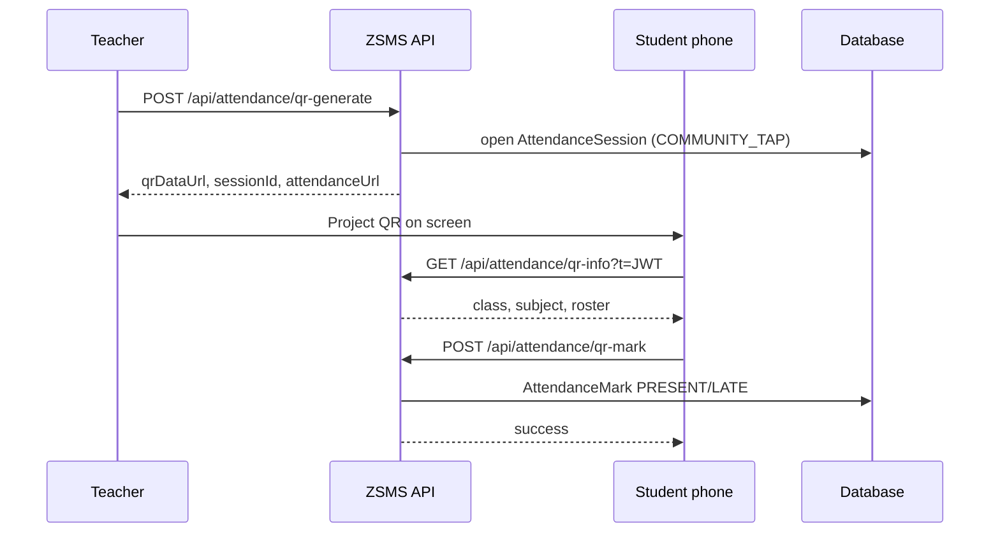

# QR Code Attendance

QR attendance lets teachers project a time-limited code so pupils mark themselves present from any phone browser—no app install required.

---

## Flow



1. Teacher starts a session (dashboard or API).
2. Server creates an **open** `AttendanceSession` and signs a **15-minute JWT**.
3. QR encodes `{portal}/attend?t={token}`.
4. Student scans → lands on `/attend` → picks name or types it.
5. Server validates token, enrollment, and duplicate marks.
6. Teacher sees live counts via existing session APIs (`GET /api/mobile/attendance/sessions`).

---

## Teacher: start a QR session

**Endpoint:** `POST /api/attendance/qr-generate`  
**Auth:** Teacher (or admin/HOD) JWT + school tenant context.

**Body:**

```json
{
  "classId": "class-uuid",
  "subjectId": "subject-uuid",
  "periodLabel": "Period 2",
  "term": 1,
  "academicYear": "2026"
}
```

**Response:**

```json
{
  "success": true,
  "qrDataUrl": "data:image/png;base64,...",
  "sessionId": "...",
  "expiresAt": "2026-05-26T10:15:00.000Z",
  "attendanceUrl": "https://school.example.com/attend?t=...",
  "className": "Form 2A",
  "subjectName": "Mathematics"
}
```

Display `qrDataUrl` in an `` tag or open `attendanceUrl` for testing. Reusing the same class/subject while a session is **OPEN** returns the existing session (no duplicate sessions per teacher/class/subject).

---

## Student: mark attendance

1. Scan QR (camera app or browser).
2. Open `/attend?t=...` on the school subdomain.
3. Tap your name (classes ≤ 40 on roll) or type your full name.
4. See confirmation; duplicate scans return “already marked”.

**Mark endpoint:** `POST /api/attendance/qr-mark` (no login cookie; JWT is the credential).

```json
{
  "token": "<jwt from qr url>",
  "studentId": "optional-if-picked-from-list",
  "studentName": "optional-if-typed"
}
```

**Info endpoint (page load):** `GET /api/attendance/qr-info?t={token}` — roster and session labels.

---

## Security model

| Control     | Implementation                                                               |
| ----------- | ---------------------------------------------------------------------------- |
| Forgery     | JWT signed with `JWT_SECRET + '-qr-attendance'` (separate from login tokens) |
| Replay      | 15-minute `exp`; session must stay `OPEN`                                    |
| Wrong class | `schoolId`, `classId`, `subjectId` embedded in token and checked against DB  |
| Not on roll | `PupilSubjectEnrollment` roster check before mark                            |
| Double mark | Unique `(sessionId, studentId)`; present/late returns **409**                |
| Twin pupils | Same rules as face attendance (`TWIN_SECONDARY_AUTH_REQUIRED` if configured) |

Marks are stored with verification method **`COMMUNITY_TAP`** (community / QR tap-in).

---

## Offline behaviour

| Scenario                            | Behaviour                                                                                                      |
| ----------------------------------- | -------------------------------------------------------------------------------------------------------------- |
| Teacher offline after generating QR | QR JWT remains valid for 15 minutes; students can still open `/attend` if they have connectivity to the server |
| Student offline at scan             | Page cannot load roster or mark until online; no local queue in web MVP (mobile app may queue separately)      |
| Teacher closes session              | New marks rejected; students see “session closed”                                                              |

For unreliable networks, keep the roster UI simple (large tap targets, minimal assets) on `/attend`.

---

## Code locations

| File                                      | Purpose                                                  |
| ----------------------------------------- | -------------------------------------------------------- |
| `lib/attendance/qr.js`                    | JWT + QR PNG generation, token validation, name matching |
| `app/api/attendance/qr-generate/route.js` | Teacher starts session                                   |
| `app/api/attendance/qr-info/route.js`     | Public session + roster for mobile page                  |
| `app/api/attendance/qr-mark/route.js`     | Public mark endpoint                                     |
| `app/attend/page.js`                      | Mobile landing page                                      |
| `lib/attendance/sessions.js`              | Shared session open/mark/close logic                     |

---

## Environment

Requires **`JWT_SECRET`** (≥ 32 characters), same as auth. No extra env vars for QR.

---

## Testing

```bash
npm test -- __tests__/api/attendance-qr.test.js
```

Unit tests cover token sign/verify, expiry, and roster name resolution.
