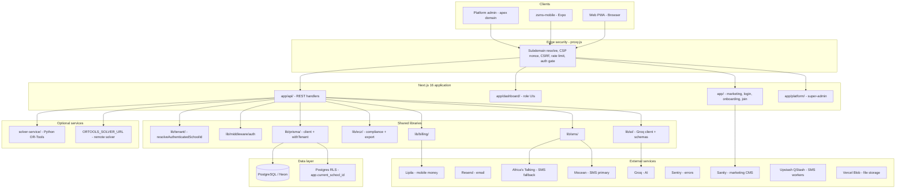

# ZSMS System Documentation

**Zambian School Management System (ZSMS)**  
**Last updated:** 2026-06-12  
**Application version:** 2.0.3 (`package.json`)  
**Document version:** 1.0

This is the **authoritative system overview** for the ZSMS monorepo. For step-by-step setup, feature deep-dives, and API catalogs, follow the links in [Related documentation](#related-documentation).

---

## Executive summary

ZSMS is a **multi-tenant school management platform** built for Zambian primary and secondary schools. Each school operates in an isolated tenant (`schoolId`), typically accessed via a **per-school subdomain** (e.g. `https://stmarys.bluepeacktechnologies.com`).

The product delivers:

- Role-based web dashboards (headteacher, HOD, teacher, student, admin)
- **ECZ-aligned** School-Based Assessment (SBA) and submission workflows
- Timetabling, attendance (including QR and offline), lesson plans, and results
- **Mobile money billing** (Lipila), email onboarding (Resend), and SMS (Mocean primary, Africa's Talking fallback)
- AI-assisted teaching tools (Groq / Vercel AI SDK)
- An optional **Expo mobile app** (`zsms-mobile/`) for teacher attendance and sync
- A **platform super-admin** console for operator-level school and billing oversight

The web app is a **Next.js 16 App Router** application backed by **PostgreSQL (Neon)** via **Prisma 6**, deployed primarily on **Vercel**. Security is enforced at the edge through `proxy.js` (subdomain routing, CSP, CSRF, rate limits, auth gates).

---

## System architecture



### Request flow (typical tenant API route)

```
Client → proxy.js (security headers, subdomain → x-school-subdomain)
      → app/api/.../route.js
      → authMiddleware (JWT cookie / Bearer)
      → resolveAuthenticatedSchoolId (tenant from session, not request body)
      → requireFeature / subscriptionGate (plan)
      → Prisma query (always filter by schoolId)
      → NextResponse.json
```

See [DEVELOPER_GUIDE.md](./DEVELOPER_GUIDE.md) for the canonical route template.

---

## Technology stack

| Layer            | Technology                                                   | Location / notes                                     |
| ---------------- | ------------------------------------------------------------ | ---------------------------------------------------- |
| Framework        | Next.js 16 (App Router)                                      | `app/`, `next.config.js`                             |
| UI               | React 19, Tailwind CSS, Lucide                               | `components/`, `styles/`                             |
| State            | Zustand (auth), TanStack Query                               | `lib/hooks/`, dashboard pages                        |
| Database         | PostgreSQL + Prisma 6                                        | `prisma/schema.prisma`                               |
| DB hosting       | Neon (pooled + direct URLs)                                  | `DATABASE_URL`, `DIRECT_URL`                         |
| Edge security    | `proxy.js`                                                   | Root — CSP, CSRF, subdomain, rate limits             |
| Auth             | JWT (httpOnly cookies + refresh)                             | `lib/middleware/auth`, `lib/security/cookies.js`     |
| Tenancy          | `schoolId` + subdomain                                       | `lib/tenant/resolveSchoolId.js`                      |
| Email            | Resend                                                       | `config/email.js`                                    |
| Payments         | Lipila (MTN / Airtel / Zamtel)                               | `lib/billing/`, `/api/payments/lipila/callback`      |
| SMS              | Mocean (primary) + Africa's Talking (fallback) + QStash bulk | `lib/sms/`, `/api/sms/*`                             |
| AI               | Groq (+ optional Gemini fallback) via Vercel AI SDK          | `lib/ai/`, `lib/config/env.js`                       |
| Observability    | Sentry (`@sentry/nextjs`)                                    | `sentry.*.config.ts`, `/monitoring` tunnel           |
| Marketing CMS    | Sanity (optional)                                            | `lib/sanity/`, `sanity/queries/`                     |
| File storage     | Vercel Blob                                                  | `@vercel/blob`                                       |
| Rate limiting    | Upstash Redis (optional)                                     | `lib/middleware/upstashLimiters.js`                  |
| PWA / offline    | Workbox, Dexie                                               | `public/sw.js`, `lib/offline/`                       |
| Mobile           | Expo 56 + React Native                                       | `zsms-mobile/`                                       |
| Timetable solver | Hybrid backtracking + optional `solver-service`              | `lib/timetable/hybridGenerate.ts`, `solver-service/` |
| Testing          | Vitest, Playwright, Jest (legacy)                            | `__tests__/`, `vitest.config.*`                      |
| CI               | GitHub Actions                                               | `.github/workflows/`                                 |
| Deployment       | Vercel (primary)                                             | `vercel.json`, `scripts/vercel-build.js`             |

**Node.js:** 24.x (see `package.json` engines).

---

## Repository structure

```
school_management_systems/
├── app/                    # Next.js App Router — pages and API routes
│   ├── api/                # ~280 REST route handlers
│   ├── dashboard/          # Role-based dashboards (~100 pages)
│   ├── platform/           # Platform super-admin UI
│   ├── login/, onboarding/, join/
│   └── layout.js           # Server layout; imports lib/config/env.js validation
├── components/             # React UI (dashboard, forms, timetable, ui/)
├── lib/                    # Business logic, middleware, integrations (~300 modules)
│   ├── ai/                 # Groq client, schemas, streaming
│   ├── attendance/         # Sessions, QR, live summary
│   ├── billing/            # Plans, Lipila activation
│   ├── ecz/                # SBA rules, export, rubrics
│   ├── middleware/         # auth, errorHandler, subscriptionGate, verify-tenant
│   ├── prisma/             # Client, withTenant, tenantClient
│   ├── security/           # headers, CSRF, cookies, rate limits
│   ├── sms/                # Africa's Talking templates
│   ├── tenant/             # resolveAuthenticatedSchoolId
│   └── timetable/          # Scheduler, pipeline, validation
├── prisma/
│   ├── schema.prisma       # ~100 models, School-centric multi-tenancy
│   ├── migrations/         # Production schema migrations
│   └── seeds/              # ECZ, schools, platform admin, etc.
├── proxy.js                # Next.js 16 edge proxy — security + tenancy headers
├── docs/                   # Documentation (this file is the system overview)
├── __tests__/              # Vitest API/unit tests + Jest legacy tests
├── scripts/                # Build, seeds, API doc generation, tenant audit
├── public/                 # Static assets, PWA, fonts
├── sanity/                 # GROQ queries for marketing homepage
├── solver-service/         # Optional Python timetable solver (Docker :8001)
├── zsms-mobile/            # Expo teacher mobile app
├── config/                 # Email and app config
├── data/                   # Static subject/catalog data
└── vercel.json             # Vercel build, region (fra1), cron jobs
```

---

## Core domains and modules

| Domain                      | Purpose                                                                                                                                                                                                                                                                                                                                                                                                                                                                                                                                                                                                                                                                                                                                                                                                                                                                                                                                                                                                                                                                                                                                                                                                                                                                                                                                                                                  | Key paths                                                                                                                                                                                                                                                                                                                                                                                                                                        |
| --------------------------- | ---------------------------------------------------------------------------------------------------------------------------------------------------------------------------------------------------------------------------------------------------------------------------------------------------------------------------------------------------------------------------------------------------------------------------------------------------------------------------------------------------------------------------------------------------------------------------------------------------------------------------------------------------------------------------------------------------------------------------------------------------------------------------------------------------------------------------------------------------------------------------------------------------------------------------------------------------------------------------------------------------------------------------------------------------------------------------------------------------------------------------------------------------------------------------------------------------------------------------------------------------------------------------------------------------------------------------------------------------------------------------------------- | ------------------------------------------------------------------------------------------------------------------------------------------------------------------------------------------------------------------------------------------------------------------------------------------------------------------------------------------------------------------------------------------------------------------------------------------------ |
| **Multi-tenancy**           | School isolation by `schoolId` and subdomain                                                                                                                                                                                                                                                                                                                                                                                                                                                                                                                                                                                                                                                                                                                                                                                                                                                                                                                                                                                                                                                                                                                                                                                                                                                                                                                                             | `prisma/schema.prisma` (`School`), `lib/tenant/`, `proxy.js`                                                                                                                                                                                                                                                                                                                                                                                     |
| **Auth & sessions**         | Login, JWT cookies, refresh, password reset                                                                                                                                                                                                                                                                                                                                                                                                                                                                                                                                                                                                                                                                                                                                                                                                                                                                                                                                                                                                                                                                                                                                                                                                                                                                                                                                              | `app/api/auth/`, `lib/middleware/auth`                                                                                                                                                                                                                                                                                                                                                                                                           |
| **Onboarding**              | School signup, email verify, Lipila payment                                                                                                                                                                                                                                                                                                                                                                                                                                                                                                                                                                                                                                                                                                                                                                                                                                                                                                                                                                                                                                                                                                                                                                                                                                                                                                                                              | `app/onboarding/`, `app/api/onboarding/`                                                                                                                                                                                                                                                                                                                                                                                                         |
| **Individual portal**       | Solo teachers (`SchoolType.INDIVIDUAL`)                                                                                                                                                                                                                                                                                                                                                                                                                                                                                                                                                                                                                                                                                                                                                                                                                                                                                                                                                                                                                                                                                                                                                                                                                                                                                                                                                  | `app/join/`, `app/dashboard/solo/`, `lib/middleware/individual-gate.js`                                                                                                                                                                                                                                                                                                                                                                          |
| **Platform admin**          | Cross-tenant operator console; **School usage** page = per-tenant student/teacher counts only (no PII)                                                                                                                                                                                                                                                                                                                                                                                                                                                                                                                                                                                                                                                                                                                                                                                                                                                                                                                                                                                                                                                                                                                                                                                                                                                                                   | `app/platform/usage/`, `GET /api/platform/stats/school-usage`, `lib/platform/schoolUsageStats.js`                                                                                                                                                                                                                                                                                                                                                |
| **ECZ / SBA**               | ZECF/ECSEOL-aligned assessments, exemplars, exam scenarios, moderation, scores, submissions                                                                                                                                                                                                                                                                                                                                                                                                                                                                                                                                                                                                                                                                                                                                                                                                                                                                                                                                                                                                                                                                                                                                                                                                                                                                                              | `lib/ecz/assessment-engine.js`, `lib/ecz/ecz-reference-constants.js`, `app/api/ecz/`, `app/api/ai/ecz-exam-questions`, `app/api/assessments/sba-*`                                                                                                                                                                                                                                                                                               |
| **Interactive assessments** | Teacher-created quizzes published as assignments; headteacher/HOD overview of teacher performance (% from submissions)                                                                                                                                                                                                                                                                                                                                                                                                                                                                                                                                                                                                                                                                                                                                                                                                                                                                                                                                                                                                                                                                                                                                                                                                                                                                   | `app/api/assessments/`, `GET /api/assessments/teacher-overview`, `/dashboard/assessments`, `lib/assessments/teacherOverview.js`                                                                                                                                                                                                                                                                                                                  |
| **Primary CBC**             | Competency ratings (ECE–G7), CSV export, continuous-assessment-tool feature                                                                                                                                                                                                                                                                                                                                                                                                                                                                                                                                                                                                                                                                                                                                                                                                                                                                                                                                                                                                                                                                                                                                                                                                                                                                                                              | `CbcCompetencyRating`, `app/api/cbc/`, `/dashboard/teacher/assessments/cbc`                                                                                                                                                                                                                                                                                                                                                                      |
| **Timetabling**             | Generate repairs legacy multi-class pushes via **`normalizePushedAllocations`** (upserts real `TeacherAllocation` per class — no synthetic IDs) → **`remapEntriesToValidAllocationIds`** before save → **`filterConflictFreeSchedulerEntries`** / **`isConflict`** / **`hasConflict`** (teacher+class+same day: same subject blocked; different subjects blocked only on period overlap; teacher/class slot rules unchanged). Scheduler **`canPlace`** + **`tryReassignTeacherClassBlocks`** backtrack; **`backtrackReassignAssignments`** in auto-resolve (dev console logs MOVED/STUCK). **`Class.isActive`** synced on publish via **`syncClassActiveFlags`**; timetable APIs default to **`getActiveClasses`** (teaching/timetable/allocation usage only). Class tabs use **`filterClassesForWallGrid`** (assignments only, deduped labels, no enrolment shells); wall grids use **`filterClassesForWallGrid`** and **`alignAssignmentsToBellRows`**. Headteacher dashboard **`TimetableSummary`** previews the **class wall** (`AscClassWallGrid`), loading **published** then **draft**. Period labels use **`formatPeriodConfigLabel`** with class count for multi-class allocations. Headteacher **Edit** tab + `/dashboard/headteacher/timetable/edit` → **Class wall** default (`AscClassWallGrid`). Secondary grades: **Forms 1–6** and **Grades 10–12** only (no Grade 8/9). | `lib/timetable/constraintCheck.ts`, `lib/timetable/activeClasses.ts`, `lib/timetable/getActiveClasses.js`, `lib/timetable/gridHelpers.js`, `lib/timetable/formatPeriodConfig.js`, `lib/timetable/solverBacktrackResolve.ts`, `lib/timetable/scheduler.ts`, `lib/timetable/resolveDepartmentClasses.js`, `components/timetable/TimetableClassPicker.tsx`, `components/timetable/AscClassWallGrid.tsx`, `components/dashboard/TimetableSummary.js` |
| **Attendance**              | Sessions, QR, offline Dexie sync, live summary, **parent SMS** on mark (absent/late by default; toggles on `/dashboard/sms`)                                                                                                                                                                                                                                                                                                                                                                                                                                                                                                                                                                                                                                                                                                                                                                                                                                                                                                                                                                                                                                                                                                                                                                                                                                                             | `lib/attendance/parentNotifications.js`, `lib/attendance/sessions.js`, `app/api/attendance/`, [QR_ATTENDANCE.md](./QR_ATTENDANCE.md), [OFFLINE_GUIDE.md](./OFFLINE_GUIDE.md)                                                                                                                                                                                                                                                                     |
| **Lesson plans**            | Authoring, HOD review, AI generation                                                                                                                                                                                                                                                                                                                                                                                                                                                                                                                                                                                                                                                                                                                                                                                                                                                                                                                                                                                                                                                                                                                                                                                                                                                                                                                                                     | `app/api/lesson-plans/`, `lib/lesson-plans/`                                                                                                                                                                                                                                                                                                                                                                                                     |
| **Results & reports**       | End-of-term, midterm, and class-test results (secondary/combined G8+ only); parent SMS when all enrolled subjects finalized                                                                                                                                                                                                                                                                                                                                                                                                                                                                                                                                                                                                                                                                                                                                                                                                                                                                                                                                                                                                                                                                                                                                                                                                                                                              | `lib/results/checkAndNotifyParent.js`, `ResultsStatus`, `app/api/teacher/results/`                                                                                                                                                                                                                                                                                                                                                               |
| **Fee management**          | Private/grant-aided invoicing: schedules, bulk invoice generation (sibling discounts), manual `FeePayment` ledger, KPI summary; **separate** from Lipila `SchoolFeePayment` mobile-money attempts                                                                                                                                                                                                                                                                                                                                                                                                                                                                                                                                                                                                                                                                                                                                                                                                                                                                                                                                                                                                                                                                                                                                                                                        | `lib/fees/*`, `FeeSchedule`, `StudentInvoice`, `FeePayment`, `SiblingGroup`, `/api/fees/*`, `/dashboard/headteacher/fees/*`, `lib/school/feeManagementAccess.js`, `assertFeeManagementAllowed`                                                                                                                                                                                                                                                   |
| **Parent portal (fees)**    | Student login read-only view: invoice balances, attendance counts, latest `Result` rows — gated `parent-portal` / `canUseFeeManagement`                                                                                                                                                                                                                                                                                                                                                                                                                                                                                                                                                                                                                                                                                                                                                                                                                                                                                                                                                                                                                                                                                                                                                                                                                                                  | `lib/fees/parentPortal.js`, `GET /api/parent/portal`, `/dashboard/student/parent-view`                                                                                                                                                                                                                                                                                                                                                           |
| **Proprietor overview**     | Headteacher/ADMIN financial KPIs (enrolment, collection rate, outstanding, monthly `FeePayment` chart) — v1 without separate `proprietor` role                                                                                                                                                                                                                                                                                                                                                                                                                                                                                                                                                                                                                                                                                                                                                                                                                                                                                                                                                                                                                                                                                                                                                                                                                                           | `lib/fees/proprietor.js`, `GET /api/proprietor/overview`, `/dashboard/proprietor`, `requireSchoolTypeAccess(..., 'proprietor-dashboard')`                                                                                                                                                                                                                                                                                                        |
| **Lipila school fees**      | Parent mobile-money payment attempts (not invoice-linked in v1); blocked for `GOVERNMENT` ownership                                                                                                                                                                                                                                                                                                                                                                                                                                                                                                                                                                                                                                                                                                                                                                                                                                                                                                                                                                                                                                                                                                                                                                                                                                                                                      | `SchoolFeePayment`, `lib/payments/feePayments.js`, `GET`/`POST` `/api/payments/mobile-money/`, `/dashboard/payments`                                                                                                                                                                                                                                                                                                                             |
| **Transport & hostel**      | Bus route assignment and boarding lists; **gender-enforced** dormitory assignment (`male`/`female`/`mixed` rooms)                                                                                                                                                                                                                                                                                                                                                                                                                                                                                                                                                                                                                                                                                                                                                                                                                                                                                                                                                                                                                                                                                                                                                                                                                                                                        | `BusRoute`, `StudentBusRoute`, `HostelRoom`, `StudentHostel`, `lib/hostel/genderMatch.js`, `/api/transport/*`, `/api/hostel/*`                                                                                                                                                                                                                                                                                                                   |
| **Inter-house**             | Social competition houses (all school levels); any student assignable; gender stats per house for manual balancing                                                                                                                                                                                                                                                                                                                                                                                                                                                                                                                                                                                                                                                                                                                                                                                                                                                                                                                                                                                                                                                                                                                                                                                                                                                                       | `SchoolHouse`, `StudentHouseMembership`, `lib/houses/`, `/api/houses/*`, `/dashboard/headteacher/houses`                                                                                                                                                                                                                                                                                                                                         |
| **Government school tools** | EMIS HDCT export, grants tracking, gender/GPI report, teacher leave, deployments — `GOVERNMENT` / `COMMUNITY` ownership only                                                                                                                                                                                                                                                                                                                                                                                                                                                                                                                                                                                                                                                                                                                                                                                                                                                                                                                                                                                                                                                                                                                                                                                                                                                             | `lib/government/*`, `SchoolGrant`, `GrantAllocation`, `TeacherLeave`, `TeacherDeployment`, `/api/government/*`, `/dashboard/headteacher/government/*`                                                                                                                                                                                                                                                                                            |
| **Billing**                 | Plans, trials, Lipila subscription payments (ZSMS platform billing — not school fees)                                                                                                                                                                                                                                                                                                                                                                                                                                                                                                                                                                                                                                                                                                                                                                                                                                                                                                                                                                                                                                                                                                                                                                                                                                                                                                    | `lib/billing/plan-pricing.js`, `app/api/billing/`, `SchoolPlanPayment` model                                                                                                                                                                                                                                                                                                                                                                     |
| **SMS**                     | Mocean-primary routing via `sendOutboundSms`; Africa's Talking fallback + bulk QStash; onboarding welcome from **ZSMS**; parent results SMS **prefixes school name**; dev test routes `/api/sms/test/onboarding`, `/api/sms/test/results-parent`                                                                                                                                                                                                                                                                                                                                                                                                                                                                                                                                                                                                                                                                                                                                                                                                                                                                                                                                                                                                                                                                                                                                         | `lib/sms/sendOutbound.js`, `lib/sms/mocean.js`, `lib/attendance/parentNotifications.js`, `app/api/sms/`, [SMS_GUIDE.md](./SMS_GUIDE.md)                                                                                                                                                                                                                                                                                                          |
| **AI features**             | Lesson planner, quizzes, topic tests (RAG material picker), report comments, RAG                                                                                                                                                                                                                                                                                                                                                                                                                                                                                                                                                                                                                                                                                                                                                                                                                                                                                                                                                                                                                                                                                                                                                                                                                                                                                                         | `lib/ai/`, `GET /api/materials/rag-preview`, `/dashboard/teacher/topic-test`, [AI_GUIDE.md](./AI_GUIDE.md), [RAG.md](./RAG.md)                                                                                                                                                                                                                                                                                                                   |
| **Games**                   | Teacher CRUD (`/api/games`), student play + badges/streaks from DB                                                                                                                                                                                                                                                                                                                                                                                                                                                                                                                                                                                                                                                                                                                                                                                                                                                                                                                                                                                                                                                                                                                                                                                                                                                                                                                       | `app/api/games/`, `app/api/dashboard/student/games/`, `lib/games/awardBadges.js`                                                                                                                                                                                                                                                                                                                                                                 |
| **Mobile API**              | Teacher attendance, sync, push tokens                                                                                                                                                                                                                                                                                                                                                                                                                                                                                                                                                                                                                                                                                                                                                                                                                                                                                                                                                                                                                                                                                                                                                                                                                                                                                                                                                    | `app/api/mobile/` (12 routes)                                                                                                                                                                                                                                                                                                                                                                                                                    |
| **Marketplace**             | Shared teaching materials                                                                                                                                                                                                                                                                                                                                                                                                                                                                                                                                                                                                                                                                                                                                                                                                                                                                                                                                                                                                                                                                                                                                                                                                                                                                                                                                                                | `app/api/marketplace/`, `SharedMaterial` model                                                                                                                                                                                                                                                                                                                                                                                                   |
| **USSD**                    | Parent portal via USSD gateway                                                                                                                                                                                                                                                                                                                                                                                                                                                                                                                                                                                                                                                                                                                                                                                                                                                                                                                                                                                                                                                                                                                                                                                                                                                                                                                                                           | `app/api/ussd/`, [USSD_GUIDE.md](./USSD_GUIDE.md)                                                                                                                                                                                                                                                                                                                                                                                                |
| **Innovation / SDG**        | School innovation projects, SDG dashboard                                                                                                                                                                                                                                                                                                                                                                                                                                                                                                                                                                                                                                                                                                                                                                                                                                                                                                                                                                                                                                                                                                                                                                                                                                                                                                                                                | `app/dashboard/innovation/`, `app/api/innovation/`                                                                                                                                                                                                                                                                                                                                                                                               |

Regenerate the API catalog after route changes: `npm run docs:api-routes` → [API_ROUTES.md](./API_ROUTES.md).

---

## Data model overview

### Tenancy model

- **`School`** is the tenant root (`prisma/schema.prisma`). Almost every domain model includes `schoolId` and relates to `School`.
- Schools are addressed by **`subdomain`** (unique) or optional **`domain`** (custom domain).
- **`SchoolType`**: `SCHOOL` (default) or `INDIVIDUAL` (solo teacher workspace).
- **`SchoolOwnership`**: `PRIVATE` (default) or `GOVERNMENT` — gates fee management and related billing APIs.
- **`User`** belongs to exactly one school; email is unique per school (`@@unique([schoolId, email])`).
- **`Student`**, **`Teacher`**, **`HeadOfDepartment`** extend users with role-specific profiles.

### Model scale

The Prisma schema defines **~100 models**, grouped roughly as:

| Group              | Examples                                                                                                                                                                 |
| ------------------ | ------------------------------------------------------------------------------------------------------------------------------------------------------------------------ |
| Core tenancy       | `School`, `User`, `RefreshToken`, `AuditLog`, `EnrollmentInvite`                                                                                                         |
| People             | `Student`, `Teacher`, `HeadOfDepartment`                                                                                                                                 |
| Academic structure | `Class` (`isActive`, deduped labels in timetable UI), `Subject`, `Department`, `TeachingAssignment`, `PupilSubjectEnrollment`                                            |
| Timetable          | `TimeSlot`, `TimetableVersion`, `TimetableEntry`, `TimetableAllocationEntry`, `TimetableDraftMeta`, `TeacherAllocation`, `SchedulingRecipe`                              |
| Assessment & ECZ   | `EczAssessment`, `EczAssessmentScore`, `EczSubmission`, `EczCompetency`, `EczSubjectConstruct`, `EczExemplar`, `CbcCompetencyRating`                                     |
| Attendance         | `Attendance`, `AttendanceSession`, `AttendanceMark`                                                                                                                      |
| Operations         | `LessonPlan`, `TermReport`, `SmsBroadcast`, `SchoolPlanPayment`, `SchoolFeePayment`, `FeeSchedule`, `StudentInvoice`, `FeePayment`, `SiblingGroup`, `SchoolRegistration` |
| HOD admin          | `HodBudgetCategory`, `HodMeeting`, `HodStockItem`, etc.                                                                                                                  |

Seed ECZ reference data: `npm run seed:ecz`.

### Row-level security

Postgres **RLS** policies (migration `20260528120000_enable_rls`) complement application-level `schoolId` filtering. Context is set via `lib/db/school-context.js` (`withSchoolContext`, `setSchoolContext`). See [SECURITY.md](./SECURITY.md) and [RLS.md](./RLS.md).

### Prisma tenant helpers

- **`getTenantClient(schoolId)`** — auto-injects `schoolId` on reads/writes (`lib/prisma/tenantClient.js`)
- **`withTenantClient(request, fn)`** — wraps handlers (`lib/prisma/withTenant.js`)
- Platform/onboarding routes use **`basePrisma`** from `lib/prisma/client.js`

Run tenant isolation audit before releases: `npm run audit:tenant`.

---

## Security model

### Edge layer (`proxy.js`)

Root-level **Next.js 16 proxy** handles:

| Control                   | Implementation                                                                                                                          |
| ------------------------- | --------------------------------------------------------------------------------------------------------------------------------------- |
| CSP with nonce            | `lib/security/headers.js` — per-request nonce via `x-nonce`                                                                             |
| CSRF                      | `verifyCsrfRequest` — state-changing `/api/*` except exempt paths (auth, webhooks)                                                      |
| Rate limiting             | `checkProxyRateLimit` — `lib/security/proxyRateLimit.js`                                                                                |
| Anti-scraping             | `checkAntiScraping` + `checkApiScrapeRateLimit` — `lib/security/antiScraping.js` (bot UA block, XHR client validation, API rate limits) |
| Method blocking           | `BLOCKED_HTTP_METHODS`                                                                                                                  |
| Cross-origin API block    | `isForbiddenCrossOrigin`                                                                                                                |
| Subdomain → tenant header | Sets `x-school-subdomain` from verified hostname only                                                                                   |
| Header stripping          | `stripInternalRequestHeaders` — prevents tenant spoofing (CVE-2025-29927 class)                                                         |
| Auth gate                 | Protected `/dashboard` and `/api` paths require token cookie or `Authorization`                                                         |
| Admin API gate            | `/api/admin/*` requires admin role keys                                                                                                 |

Static security headers also apply via `next.config.js`; **dynamic CSP uses the proxy nonce**.

### Authentication

- **Access token:** `access_token` httpOnly cookie (JWT, HS256), `sameSite: strict`, `secure` in production
- **Refresh token:** `refresh_token` httpOnly cookie scoped to `Path=/api/auth/refresh`; signed with `JWT_REFRESH_SECRET` in production. Concurrent refresh in multiple tabs uses a **30s rotation grace window** (`REFRESH_ROTATION_GRACE_MS`) so benign reuse does not revoke all sessions. Browser AI calls use `lib/auth/sessionFetch.js` (deduplicated refresh + CSRF header).
- **Mobile:** Bearer tokens via `/api/mobile/auth/login` and `/api/mobile/auth/refresh`
- **Platform:** `isPlatform: true` + `superadmin` role; `schoolId: null` — only controlled cross-tenant bypass

### Password policy

Central rules in `lib/security/passwordPolicy.js` (enforced on server and mirrored in forms via `components/ui/PasswordRequirements.js`):

| Rule      | Requirement                             |
| --------- | --------------------------------------- |
| Length    | Minimum 8 characters                    |
| Uppercase | At least one `A–Z`                      |
| Lowercase | At least one `a–z`                      |
| Number    | At least one digit                      |
| Special   | At least one non-alphanumeric character |

Applied on every password **set/change** path (`/api/auth/register`, onboarding, reset, profile/account password, admin user reset, school registration). **Login is denied** (`403`, code `WEAK_PASSWORD`) when credentials are correct but the password does not meet policy — users must use Forgot Password to upgrade. Auto-generated passwords use `generateCompliantPassword()`.

### XSS and output encoding

- Per-request **CSP nonce** + `strict-dynamic` for scripts (`lib/security/headers.js`, `proxy.js`)
- API `sanitizeOutput()` strips `<script>` blocks and HTML-escapes string fields (auth and student routes; extend as needed)
- User-controlled values injected into DOM must use `escapeHtml()` from `lib/security.js` (e.g. emergency alerts in `components/ZambianSchoolDashboard.js`)
- Prisma ORM is the default data path (parameterized queries); raw SQL uses bound parameters in RAG and health checks

### CORS and CSRF

- CSRF double-submit on mutating `/api/*` via `lib/security/csrf.js` and `proxy.js`
- CORS allows `X-CSRF-Token` / `x-csrf-token` for credentialed cross-origin clients (`lib/security/headers.js`)

### Anti-scraping (backend)

Enabled in production by default (`ANTI_SCRAPING_ENABLED`; set `false` to disable). Enforced at the edge in `proxy.js`:

| Control                   | Behaviour                                                                                                                         |
| ------------------------- | --------------------------------------------------------------------------------------------------------------------------------- |
| Bot user-agent block      | Rejects common scraper/script clients (`curl`, `python-requests`, `scrapy`, headless browsers, SEO bots) on `/api/*`              |
| Browser client validation | Cookie-authenticated API calls must send `X-Requested-With: XMLHttpRequest` and `Accept: application/json` (matches `lib/api.js`) |
| Cross-site API block      | Blocks credentialed API calls when `Sec-Fetch-Site` is `cross-site` / `cross-origin`                                              |
| API rate limits           | Per-IP limits on public and authenticated GET/mutation traffic (`SCRAPE_RATE_*` env vars)                                         |
| List cap helper           | `clampListLimit()` caps `?limit=` on list routes (max 100 on assessments)                                                         |
| robots.txt                | Disallows `/api/`, `/dashboard/`, `/admin/`, `/platform/` for compliant crawlers                                                  |
| API robots header         | `X-Robots-Tag: noindex, nofollow, noarchive` on all `/api/*` responses                                                            |

Exempt: `/api/mobile/*`, webhooks, health/ping, SMS workers (own signature auth).

### Tenant trust boundary

**Never trust `schoolId` from request body, query, or client headers.** The authoritative tenant comes from `resolveAuthenticatedSchoolId()` in `lib/tenant/resolveSchoolId.js`, which cross-checks JWT, DB user, subdomain, and rejects mismatches.

See [SECURITY.md](./SECURITY.md) for route classification and IDOR guards (`lib/middleware/verify-tenant.js`).

### School type and feature gating

Three fields on `School` drive what each tenant can access:

| Field           | Purpose                 | Values                                              |
| --------------- | ----------------------- | --------------------------------------------------- |
| `level`         | Curriculum band         | `primary`, `secondary`, `combined`                  |
| `ownershipType` | Funding / finance model | `PRIVATE`, `GOVERNMENT`, `COMMUNITY`, `GRANT_AIDED` |
| `schoolType`    | Workspace kind          | `SCHOOL` (multi-user), `INDIVIDUAL` (solo teacher)  |

**Single source of truth:** `lib/school/schoolTypeHelpers.js` — `getSchoolFeatures(school)`, `canUseCBC`, `canUseECZSBA`, `canUseFeeManagement`, etc. `COMMUNITY` shares government features; `GRANT_AIDED` shares private features.

**API middleware:** `lib/middleware/schoolTypeGate.js` — `requireSchoolTypeAccess(schoolId, featureKey)` (alias: `requireOwnershipAccess`) returns 403 with `code: 'SCHOOL_TYPE_GATE'`. Domain-specific wrappers: `lib/subjects/eczAccess.js` (`requireSecondarySchoolAccess`), `lib/school/hodAccess.js` (`requireHodSchoolAccess`), `lib/fees/routeAuth.js` (`authorizeFeeRoute`), `lib/government/routeAuth.js` (`authorizeGovernmentRoute`).

**UI gating:** `components/FeatureGate.js` calls `POST /api/features/check-access`, which enforces plan, school level, and `ownershipType` (`code: 'OWNERSHIP_GATE'` when blocked). See [01 government school features](./01%20government%20school%20features.md) and [02 private school features](./02%20private%20school%20features.md).

**Client:** `lib/school/useSchoolCapabilities.js` + `SchoolFeaturesProvider` in `app/providers.js`; `/api/school/current` exposes `ownershipType`. School branding cache uses `school-cache:v2:{subdomain}` in `lib/context/SchoolContext.js` so stale entries without `ownershipType` are not reused.

**Existing schools (pre–ownership selector):** `School.ownershipType` defaults to `PRIVATE` in the database. That preserves prior behaviour (fee management, private feature set) until a headteacher sets the correct type during onboarding for new schools, or an operator runs `prisma/scripts/backfill-school-ownership.sql` (e.g. set `GOVERNMENT` for government secondaries). Missing ownership does **not** block login; session bootstrap uses `/api/auth/me`, `/api/auth/refresh`, and `/api/platform/auth/me`, which are exempt from the anti-scraping XHR header check in `lib/security/antiScraping.js`. Platform admin UI pages use `sessionFetch` for all `/api/platform/*` calls.

**Legacy trial / verification:** Schools created before `trialEndsAt` was populated may have been blocked at login with `402 SUBSCRIPTION_EXPIRED`. Login and API subscription checks now call `hydrateLegacySchoolAccess()` in `lib/billing/subscription.js` to backfill `trialEndsAt` and `emailVerified` for active schools. Bulk fix: `prisma/scripts/backfill-school-trial.sql`.

**Existing wrappers** (delegate to helpers): `lib/school/hodAccess.js`, `lib/school/gradingAccess.js`, `lib/school/feeManagementAccess.js`, `lib/subjects/eczAccess.js`, `lib/middleware/planGate-zambia.js` (`requireFeature` for plan + level + ownership).

### Education-level feature gating

`School.level` (`primary` | `secondary` | `combined`) controls which modules appear in navigation, APIs, and plan feature catalogs. Grade-aware checks for combined schools remain in `lib/subjects/resolveSubjectCatalog.js` (`canAccessEczFeatures`, `canAccessHodFeatures`, `canAccessSecondaryGrading`).

| Feature                                                                        | `primary` (ECE–G7)         | `secondary` | `combined`                                             |
| ------------------------------------------------------------------------------ | -------------------------- | ----------- | ------------------------------------------------------ |
| ECZ / SBA                                                                      | Hidden                     | Allowed     | Allowed for secondary-grade classes only (G8+ / Forms) |
| HOD dashboards & assignment                                                    | Hidden                     | Allowed     | Allowed                                                |
| Secondary grading (ONE–FOUR / 1–9 result entry, best-six, school-wide results) | Hidden                     | Allowed     | Allowed for secondary-grade classes only               |
| Fee management / parent payments                                               | Private & grant-aided only | —           | —                                                      |
| Government tools (EMIS, grants, leave, deployment)                             | Govt & community only      | —           | —                                                      |

Primary schools use **CBC Assessment** (`/dashboard/teacher/assessments/cbc`) for competency ratings and annual CSV export. Secondary schools use **ECZ SBA Hub** with ECSEOL exam scenarios, exemplar clone, and moderation. Combined schools see both nav entries.

### Environment validation

Startup validation in `lib/config/env.js` (imported from `app/layout.js`). Production weak-secret checks in `lib/security/env.js`.

---

## API conventions

| Convention     | Detail                                                       |
| -------------- | ------------------------------------------------------------ |
| Location       | `app/api/<feature>/route.js` or `[id]/route.js`              |
| Dynamic routes | `export const dynamic = 'force-dynamic'` for DB/auth routes  |
| Error handling | `withErrorHandler` from `lib/middleware/errorHandler.js`     |
| Secure wrapper | `withSecureApi` where applicable                             |
| Auth           | `authMiddleware(request)` → check `auth.isAuthenticated`     |
| Roles          | `roleCheck(auth.user, [...])` or `requireRole`               |
| Tenancy        | `resolveAuthenticatedSchoolId(request, auth.user)`           |
| Plans          | `requireFeature(schoolId, 'feature-id')`, `subscriptionGate` |
| Logging        | `logger({ route })`, `captureError` — no secrets in logs     |
| Versioning     | `/api/v1/*` deprecated (Sunset header set in proxy)          |
| Health         | `GET /api/health`, `GET /api/ping`                           |
| CSRF token     | `GET /api/csrf-token` for browser clients                    |

Full route list: [API_ROUTES.md](./API_ROUTES.md) (auto-generated).

---

## User roles and portals

### School roles (`User.role`)

| Role                     | Dashboard entry          | Typical capabilities                                                                                              |
| ------------------------ | ------------------------ | ----------------------------------------------------------------------------------------------------------------- |
| `headteacher`            | `/dashboard/headteacher` | School-wide admin, timetable publish, assessments overview, MOE reports, government tools (EMIS, grants), billing |
| `hod` / `HOD`            | `/dashboard/hod`         | Department staff, allocations, lesson plan review, budget                                                         |
| `teacher`                | `/dashboard/teacher`     | Classes, SBA, attendance, lesson plans, results                                                                   |
| `student`                | `/dashboard/student`     | Subjects, assessments, results, study tools, ECZ practice                                                         |
| `ADMIN` / admin variants | `/dashboard/admin`       | User registration, school settings                                                                                |

Role normalization handles case and aliases (e.g. `headmaster`, `principal`) in auth middleware.

### Portal types

| Portal           | URL pattern                             | Doc                                            |
| ---------------- | --------------------------------------- | ---------------------------------------------- |
| School tenant    | `https://{subdomain}.{APP_BASE_DOMAIN}` | This doc                                       |
| Solo teacher     | `/dashboard/solo` after `/join`         | [INDIVIDUAL_PORTAL.md](./INDIVIDUAL_PORTAL.md) |
| Platform admin   | Apex domain `/login` → `/platform`      | [PLATFORM_ADMIN.md](./PLATFORM_ADMIN.md)       |
| Public marketing | `/` (Sanity-driven when configured)     | `lib/sanity/marketingHomepage.js`              |

All accounts receive a **2-month trial** (`trialEndsAt`); subscription required afterward via `/dashboard/billing`.

---

## Integrations

| Service                                               | Purpose                                      | Config / entry points                                                           |
| ----------------------------------------------------- | -------------------------------------------- | ------------------------------------------------------------------------------- |
| **Neon PostgreSQL**                                   | Primary database                             | `DATABASE_URL`, `DIRECT_URL`                                                    |
| **Vercel**                                            | Hosting, cron, Blob                          | `vercel.json`, region `fra1`                                                    |
| **Resend**                                            | Transactional email                          | `RESEND_API_KEY`, `EMAIL_FROM_NOREPLY`                                          |
| **Lipila**                                            | Mobile money (onboarding + billing)          | `LIPILA_API_KEY`, callbacks under `/api/payments/lipila/`                       |
| **Mocean**                                            | SMS send (primary when token set)            | `MOCEAN_API_TOKEN`, `lib/sms/mocean.js`, `sendOutboundSms`                      |
| **Africa's Talking**                                  | SMS send/receive (fallback + bulk broadcast) | `AFRICASTALKING_*`, webhooks `/api/sms/inbound`, `/api/sms/delivery`            |
| **Upstash QStash**                                    | Async SMS broadcast workers                  | `QSTASH_*`, `/api/sms/queue-worker`                                             |
| **Groq / Gemini / OpenRouter / OpenAI / HuggingFace** | AI text generation (multi-provider fallback) | `lib/ai/provider-fallback.ts` — see [AI_GUIDE.md](./AI_GUIDE.md)                |
| **HuggingFace / Jina / Voyage**                       | RAG embeddings (384-dim)                     | `HUGGINGFACE_API_KEY`, `JINA_API_KEY`, `VOYAGE_API_KEY`; see [RAG.md](./RAG.md) |
| **Sentry**                                            | Error monitoring                             | `SENTRY_DSN`, `NEXT_PUBLIC_SENTRY_DSN`                                          |
| **Sanity**                                            | Marketing homepage CMS                       | `SANITY_PROJECT_ID`, `SANITY_API_READ_TOKEN`                                    |
| **Upstash Redis**                                     | Rate limits (optional)                       | Used by `lib/middleware/upstashLimiters.js` when configured                     |

Payment logos: `public/payments/` or `NEXT_PUBLIC_PAYMENT_LOGO_*`.

Vercel crons (see `vercel.json`; all require `CRON_SECRET` via `Authorization: Bearer` or `x-cron-secret`):

- `/api/cron/ecz-reminder` — 15 January ECZ deadline reminders
- `/api/cron/sms-low-balance` — daily SMS balance check
- `/api/cron/fee-overdue-check` — weekly (Mondays 07:00 UTC): mark overdue invoices, SMS parents via Africa's Talking

---

## Mobile app (`zsms-mobile/`)

| Item       | Detail                                                         |
| ---------- | -------------------------------------------------------------- |
| Stack      | Expo 56, Expo Router, TypeScript, Zustand                      |
| Package    | `com.bluepeack.zsms.teacher`                                   |
| Scope      | Teacher attendance, SBA scores, lesson plan cache, push tokens |
| API prefix | `/api/mobile/*` (12 routes)                                    |
| Auth       | `/api/mobile/auth/login`, `/api/mobile/auth/refresh`           |
| Build      | EAS (`eas build`) — see `zsms-mobile/docs/EAS_APK_BUILD.md`    |

Web-only workflows (timetable master build, billing, full ECZ submission, bulk SMS) remain on the school web portal. See [mobile-app-scope.md](./mobile-app-scope.md) and [doc/mobile-app.md](./doc/mobile-app.md).

Mobile env template: `zsms-mobile/.env.example`.

---

## Environment variables

**Do not commit secrets.** Use `.env.local` locally and Vercel environment settings in production.

| Category        | Variables                                                                                                                     | Reference                          |
| --------------- | ----------------------------------------------------------------------------------------------------------------------------- | ---------------------------------- |
| Required        | `DATABASE_URL`, `JWT_SECRET`, `RESEND_API_KEY`, `EMAIL_FROM_NOREPLY`, `GROQ_API_KEY` or `GEMINI_API_KEY`                      | [ENVIRONMENT.md](./ENVIRONMENT.md) |
| Migrations      | `DIRECT_URL`                                                                                                                  | Neon direct connection             |
| Production auth | `JWT_REFRESH_SECRET`, `COOKIE_DOMAIN`, `APP_BASE_DOMAIN`                                                                      | Multi-subdomain cookies            |
| Features        | `LIPILA_*`, `AFRICASTALKING_*`, `QSTASH_*`, `SENTRY_*`, `SANITY_*`, `HUGGINGFACE_API_KEY`, `VOYAGE_*`, `OPENAI_API_KEY` (RAG) | Disabled when unset                |
| Local dev       | `LOCAL_DEV_SCHOOL_SUBDOMAIN`, `DEV_ONBOARDING_SKIP_EMAIL`, `PLATFORM_ADMIN_*`                                                 | See [SETUP.md](./SETUP.md)         |

Programmatic access:

```javascript
import { env, validateEnv } from '@/lib/config/env'
validateEnv()
env.features.payments // true when Lipila configured
```

Template: `.env.example` at repo root.

---

## Local development setup

```bash
git clone <repo-url>
cd school_management_systems
npm install
cp .env.example .env.local   # fill required vars
npx prisma generate && npx prisma db push
npm run seed:ecz
npm run dev                    # http://localhost:3000
```

Verify: `curl http://localhost:3000/api/health`

Full guide: [SETUP.md](./SETUP.md).

Optional seeds: `seed:local`, `seed:st-marys`, `seed:platform-admin`, `seed:timeslots`.

---

## Deployment and migrations

### Primary deployment (Vercel)

1. Connect GitHub repo to Vercel (Next.js preset).
2. Set environment variables per [ENVIRONMENT.md](./ENVIRONMENT.md).
3. Map Neon pooled URL → `DATABASE_URL`, direct URL → `DIRECT_URL`.
4. Build: `npm run build` → `scripts/vercel-build.js` runs `prisma generate` + `next build --webpack`.
5. Configure school subdomains and apex domain in Vercel DNS.

Details: [doc/VERCEL_DEPLOY.md](./doc/VERCEL_DEPLOY.md), [NEON_POST_DEPLOY_CHECKLIST.md](./NEON_POST_DEPLOY_CHECKLIST.md).

### Migrations

| Environment     | Command                                                  |
| --------------- | -------------------------------------------------------- |
| Local prototype | `npx prisma db push`                                     |
| Local tracked   | `npx prisma migrate dev --name describe_change`          |
| Production      | `npm run prisma:migrate:deploy` or CI step before deploy |
| Soft start      | `npm run start:with-migrate`                             |

Recovery: [MIGRATION_RECOVERY.md](./MIGRATION_RECOVERY.md).

**Note:** `.github/workflows/deploy.yml` references Cloudflare Workers but no `npm run deploy` script exists in `package.json`; **Vercel is the documented and configured production path** (`vercel.json`, `.vercel/`).

### Pre-release checks

```bash
npm test                  # Vitest critical paths
npm run audit:tenant      # Tenant isolation audit
npm run lint
npm run docs:api-routes   # if API routes changed
```

---

## Testing approach

| Tool           | Scope                                  | Command             |
| -------------- | -------------------------------------- | ------------------- |
| **Vitest**     | API routes, unit tests (mocked Prisma) | `npm test`          |
| **Playwright** | E2E browser tests                      | `npm run test:e2e`  |
| **Jest**       | Legacy React component tests           | `npm run test:jest` |

Critical path suites (must pass before deploy): auth, onboarding/Lipila, SBA, ECZ, offline attendance, teaching assignments — see [TESTING.md](./TESTING.md).

Test locations: `__tests__/api/`, `__tests__/unit/`, `__tests__/helpers/`, `test/security/`.

---

## Related documentation

| Document                                         | When to use                                       |
| ------------------------------------------------ | ------------------------------------------------- |
| [USER_GUIDE.md](./USER_GUIDE.md)                 | End-user guide — login, roles, workflows, nav     |
| [README.md](../README.md)                        | Detailed route catalog, Android integration notes |
| [docs/README.md](./README.md)                    | Documentation index                               |
| [SETUP.md](./SETUP.md)                           | First-time local setup                            |
| [ENVIRONMENT.md](./ENVIRONMENT.md)               | Every env variable                                |
| [DEVELOPER_GUIDE.md](./DEVELOPER_GUIDE.md)       | Adding APIs, AI, SMS, migrations                  |
| [SECURITY.md](./SECURITY.md)                     | Tenant isolation, route audit                     |
| [ECZ_COMPLIANCE.md](./ECZ_COMPLIANCE.md)         | SBA rules and models                              |
| [ECSEOL_ALIGNMENT.md](./ECSEOL_ALIGNMENT.md)     | ECSEOL 2026 teacher quick reference               |
| [INDIVIDUAL_PORTAL.md](./INDIVIDUAL_PORTAL.md)   | Solo teacher portal                               |
| [PLATFORM_ADMIN.md](./PLATFORM_ADMIN.md)         | Super-admin console                               |
| [API_ROUTES.md](./API_ROUTES.md)                 | Auto-generated API list                           |
| [TESTING.md](./TESTING.md)                       | Test conventions                                  |
| [AI_GUIDE.md](./AI_GUIDE.md)                     | AI features                                       |
| [TIMETABLE_PIPELINE.md](./TIMETABLE_PIPELINE.md) | Timetable canonical flow                          |
| [review.md](../review.md)                        | Project review and gap analysis                   |
| [CHANGELOG.md](../CHANGELOG.md)                  | Release history                                   |

---

## Maintenance

This document must stay aligned with the codebase. When making architectural or integration changes, update the relevant sections and bump **Last updated** at the top.

**Enforcement:** Cursor rules require agents to update docs in the same session:

- `.cursor/rules/update-system-documentation.mdc` — architecture, modules, APIs, schema, security, deployment, integrations
- `.cursor/rules/update-user-guide.mdc` — user-facing dashboards, workflows, roles, plans, onboarding
