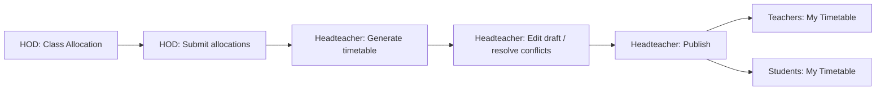

# ZSMS User Guide

**Zambian School Management System (ZSMS)**  
**Last updated:** 2026-07-11  
**Application version:** 2.0.3 (`package.json`)  
**Document version:** 1.0

This is the **authoritative end-user and operator guide** for ZSMS — how to sign up, log in, and use every implemented feature by role. For system architecture, APIs, and developer setup, see [SYSTEM_DOCUMENTATION.md](./SYSTEM_DOCUMENTATION.md).

**Navigation source of truth:** `components/dashboard/Sidebar.js` (school roles) and `components/platform/PlatformShell.js` (platform admin).

---

## Executive summary

ZSMS is a multi-tenant school management platform for Zambian primary and secondary schools. Each school gets its own portal at `https://<subdomain>.bluepeacktechnologies.com`. Staff and students log in with role-based dashboards; platform operators use a separate console on the apex domain.

Every account receives a **2-month free trial**. After trial expiry, subscription is required via `/dashboard/billing` (mobile money through Lipila).

### Primary schools (ECE–Grade 7)

When your school is registered as **Primary (ECE – Grade 7)** (`School.level = primary`):

- **HOD features are hidden** — no HOD registration, department dashboards, or HOD navigation. Teachers report to the headteacher.
- **Secondary-style grading is hidden** — no ONE–FOUR / 1–9 result entry or school-wide results pages. Use CBC continuous assessment instead.
- **Primary CBC:** **CBC Assessment** (`/dashboard/teacher/assessments/cbc`) — record ZECF competency ratings (4-level descriptors) and export CSV by 31 January. See [ECSEOL_ALIGNMENT.md](./ECSEOL_ALIGNMENT.md).
- **Combined schools** keep HOD for secondary departments; grading remains available only for **Forms 1–6 and Grades 10–12**, not for G1–G7 classes.

| Portal type       | Who                                       | Entry URL                                     |
| ----------------- | ----------------------------------------- | --------------------------------------------- |
| School tenant     | Headteacher, HOD, teacher, student, admin | `https://<subdomain>.<APP_BASE_DOMAIN>/login` |
| Solo teacher      | Individual teachers                       | `/join` → `/dashboard/solo`                   |
| New school signup | Prospective schools                       | `/onboarding` (apex domain)                   |
| Platform admin    | Bluepeak operators                        | Apex `/login` → `/platform/overview`          |

---

## Getting started

### Access URLs

| URL                                                | Purpose                                               |
| -------------------------------------------------- | ----------------------------------------------------- |
| `/login`                                           | Staff login (all school roles + platform super-admin) |
| `/forgot-password`                                 | Request password reset email                          |
| `/reset-password`                                  | Reset password with `?token=` query param             |
| `/reset-password/[token]`                          | Token-in-path variant                                 |
| `/onboarding`                                      | Full school signup                                    |
| `/onboarding?plan=trial\|basic\|standard\|premium` | Pre-select subscription plan                          |
| `/join`                                            | Solo teacher signup                                   |
| `/attend?t={jwt}`                                  | Student QR attendance (no login required)             |

### Subdomain model

- **Production:** Each school is accessed at `https://<subdomain>.bluepeacktechnologies.com`.
- **Apex domain:** `https://bluepeacktechnologies.com` hosts onboarding, solo signup, and platform login.
- **Login without subdomain:** On the apex domain, use `/login?subdomain=<school-slug>` to target a specific school.
- **Local development:** `http://localhost:3000` with `LOCAL_DEV_SCHOOL_SUBDOMAIN` in `.env.local`.

### Password requirements

All passwords must meet these rules (enforced on set/change):

| Rule      | Requirement                             |
| --------- | --------------------------------------- |
| Length    | Minimum 8 characters                    |
| Uppercase | At least one `A–Z`                      |
| Lowercase | At least one `a–z`                      |
| Number    | At least one digit                      |
| Special   | At least one non-alphanumeric character |

If login succeeds but the password is weak, you will be blocked with a message to use **Forgot Password** to upgrade.

### Post-login redirects

| Role                                              | Lands on                 |
| ------------------------------------------------- | ------------------------ |
| Platform admin (`superadmin`, `isPlatform: true`) | `/platform/overview`     |
| Headteacher / admin / administrator               | `/dashboard/headteacher` |
| HOD                                               | `/dashboard/hod`         |
| Teacher (school)                                  | `/dashboard/teacher`     |
| Teacher (solo / individual)                       | `/dashboard/solo`        |
| Student                                           | `/dashboard/student`     |

The `admin` role uses the same sidebar and capabilities as headteacher.

---

## Subscription and billing

### Free trial

- **Duration:** 2 months (~60 days) for all account types.
- **During trial:** Full access to plan features.
- **After expiry:** Dashboard shows a subscription banner; main content is blocked until payment.

### School plans

| Plan     | Price (ZMW/month) | Limits                              |
| -------- | ----------------- | ----------------------------------- |
| Trial    | Free (2 months)   | Full access during trial            |
| Basic    | K500              | Up to 500 students                  |
| Standard | K800              | Up to 800 students, analytics + SMS |
| Premium  | K1,200            | Unlimited students, all features    |

### Solo teacher plans

| Plan                        | Price     | Limits                        |
| --------------------------- | --------- | ----------------------------- |
| Individual                  | K50/month | Up to 10 students, ECZ tools  |
| Individual Premium          | K99/month | Unlimited students + AI tools |
| Individual Premium (Annual) | K799/year | Same as Individual Premium    |

### Billing actions

| Task                         | Route                   | Who                       |
| ---------------------------- | ----------------------- | ------------------------- |
| Subscribe or renew           | `/dashboard/billing`    | All roles when trial ends |
| School fee payments (in-app) | `/dashboard/payments`   | Headteacher, teacher      |
| Onboarding payment           | Step 2 of `/onboarding` | New schools               |

Payment methods: **MTN Mobile Money**, **Airtel Money**, **Zamtel** via Lipila.

---

## School onboarding

Full schools sign up at `/onboarding` on the apex domain.

### Step 1 — Verify email

1. Enter email and password.
2. Click **Send Verification Link**.
3. Open the link in your email — this verifies your address and sets an onboarding session cookie.

### Step 2 — Plan and payment

Choose one:

- **Free trial** — skip payment, start 2-month trial immediately.
- **Basic / Standard / Premium** — pay via mobile money (Airtel, MTN, or Zamtel).

Payment status polls automatically every 10 seconds while pending.

### Step 3 — Create portal

Provide:

- School name
- Subdomain (minimum 3 characters, becomes your portal URL)
- School level (e.g. combined)
- Admin (headteacher) name
- **Province and district** (required for reporting)

On completion, the system creates your school portal and emails the headteacher a login URL.

---

## Solo teacher portal

Solo teachers use `/join` instead of `/onboarding`. See [INDIVIDUAL_PORTAL.md](./INDIVIDUAL_PORTAL.md) for details.

### Signup flow

1. **Start** — Choose Individual (K50/mo) or Individual Premium (K99/mo); enter name, email, password.
2. **Verify email** — Open the verification link (mandatory before workspace creation).
3. **Setup** — Click **Start my free trial** → workspace created → receive login URL.

### Solo workspace

- **Home:** `/dashboard/solo` — stats, enrollment code, student list, quick links.
- **Register students:** `/admin/registration?role=student` (max 10 on Individual plan).
- **Renew:** `/dashboard/billing` after trial.

Students cannot self-signup. The teacher registers them. `/join/student` and `/join/learner` redirect away.

### Solo sidebar differences

Compared to a school teacher, solo teachers see **Solo workspace** instead of Dashboard, and these items are hidden: My Timetable, Payments, Extracurricular.

---

## Shared features (all roles)

| Feature  | Route                 | Notes                                 |
| -------- | --------------------- | ------------------------------------- |
| Profile  | `/dashboard/profile`  | Name, contact, photo, password change |
| Settings | `/dashboard/settings` | Account settings, app version         |
| Privacy  | `/dashboard/privacy`  | Privacy policy and data preferences   |
| Feedback | `/dashboard/feedback` | Submit product feedback               |
| Billing  | `/dashboard/billing`  | Subscribe when trial expires          |

### Notifications

- **Timetable notifications** — Bell icon in header for headteacher/admin when HODs push class allocations.
- **Subscription banner** — Trial countdown or expired notice on all dashboard pages.

---

## Headteacher guide

**Dashboard home:** `/dashboard/headteacher`

The headteacher is the school administrator with full oversight: users, timetable publishing, MOE reports, billing, and school-wide analytics.

### Navigation menu

| Menu item           | Route                                        |
| ------------------- | -------------------------------------------- |
| Dashboard           | `/dashboard/headteacher`                     |
| Profile             | `/dashboard/profile`                         |
| Settings            | `/dashboard/settings`                        |
| User Feedback       | `/dashboard/feedback`                        |
| User Management     | `/dashboard/users`                           |
| Bulk student upload | `/dashboard/students/bulk-upload`            |
| Bulk teacher upload | `/dashboard/teachers/bulk-upload`            |
| Registration        | `/admin/registration`                        |
| Scheduling Recipes  | `/dashboard/admin/recipes`                   |
| Subjects            | `/admin/subjects`                            |
| Guidance teachers   | `/dashboard/headteacher/guidance-teachers`   |
| Guidance reports    | `/dashboard/headteacher/guidance-reports`    |
| Teacher Performance | `/admin/teacher-performance`                 |
| Teaching Coverage   | `/dashboard/admin/teacher-performance`       |
| Classes             | `/dashboard/classes`                         |
| ECZ Exam Tracking   | `/dashboard/headteacher/exam-tracking`       |
| STEM Monitoring     | `/dashboard/headteacher/stem-monitoring`     |
| MOE Reports         | `/dashboard/headteacher/moe-reports`         |
| AI Report Comments  | `/dashboard/teacher/report-comments`         |
| Attendance Returns  | `/dashboard/attendance/returns`              |
| Timetable           | `/dashboard/headteacher/timetable`           |
| Timetable Conflicts | `/dashboard/headteacher/timetable/conflicts` |
| Transport           | `/dashboard/headteacher/transport`           |
| Inter-house         | `/dashboard/headteacher/houses`              |
| Hostel              | `/dashboard/headteacher/hostel`              |
| Assessments         | `/dashboard/assessments`                     |
| Results             | `/dashboard/results`                         |
| Payments            | `/dashboard/payments`                        |
| Billing             | `/dashboard/billing`                         |
| Privacy             | `/dashboard/privacy`                         |
| Reports             | `/dashboard/reports`                         |

**Also available (not in sidebar):** SMS broadcast at `/dashboard/sms`; class-by-class timetable grid at `/dashboard/headteacher/timetable/class-view` (link from the Timetable **Edit** tab).

**When enabled for your school:** **Fees** (schedules, invoices, sibling discounts), **Government** (EMIS export, grants, gender report, leave, deployment), and **Proprietor dashboard** appear as extra sidebar sections.

### Key workflows

#### User management

1. Go to **Registration** (`/admin/registration`) to add teachers, students, HODs, or admins one at a time.
2. For many students, use **Bulk student upload** (`/dashboard/students/bulk-upload`): click **Download student upload template**, fill rows from line 4 on the **Student Data** sheet (max 1,000 per file), upload, and download an error report for any failed rows. The template includes a **Database Mapping** sheet listing each Excel column and the matching `User`, `Student`, `Class`, and `PupilSubjectEnrollment` fields.
3. For many teachers, use **Bulk teacher upload** (`/dashboard/teachers/bulk-upload`): download the template, fill the **Teacher Data** sheet (max 500 per file). Required columns include department(s), TS number, email, and password. Optional **Teaching Assignments** use `Class:Subject` pairs separated by semicolons (e.g. `Form 1A:Mathematics; Form 2B:English`). See the **Database Mapping** sheet for `User`, `Teacher`, `Department`, and `TeachingAssignment` alignment.
4. Use **User Management** (`/dashboard/users`) to view, edit, or deactivate accounts.

#### Master timetable

The **Timetable** page (`/dashboard/headteacher/timetable`) has tabs: **Overview**, **Edit**, **Conflicts**, **Cover**, **Settings**, and **Department Allocations**.

1. Wait for HODs to submit class allocations (notification bell alerts you).
2. Open **Department Allocations** to review, **edit**, or **delete** submitted or approved rows when teachers are overloaded or allocations are wrong.
3. On the **Edit** tab, choose a view mode:
   - **Class wall** — all classes in one compact grid (aSc-style).
   - **By period** — master grid (day × period); drag lessons to move or swap.
   - **Teachers** / **One class** — filter by teacher or class.
   - **Open class-by-class grid view** — link to `/dashboard/headteacher/timetable/class-view` (one class, period × MON–FRI, teacher colour coding).
4. Click **Generate Perfect Timetable** (uses HOD allocations + bell schedule).
5. Review the draft; red borders show **conflicts** (same teacher or same class in one period). Use **Conflicts** tab or **Timetable Conflicts** in the sidebar for the full Conflict Resolution Centre (`/dashboard/headteacher/timetable/conflicts`). If the timetable is already **published** (no draft rows), the centre still scans the published schedule and shows conflicts — click **Create editable draft** there (or **Load draft** on the Edit tab) before applying fixes.
6. **Server audit issues** (for example _Missing periods_) list allocations that still need timetable slots. Fix them by placing lessons or editing allocations, or use **Dismiss** (× on each row, or **Dismiss all missing periods**) to hide warnings you have accepted for this term. Dismissed items stay hidden until the underlying allocation changes or you rescan after fixing data.
7. Fix grid conflicts by dragging lessons, removing bad entries, editing allocations, or using suggested fixes on the conflicts page.
8. Assign **teacher colours** on the **Settings** tab (or auto-assign) so grids are easy to read.
9. Click **Publish** when there are **no hard conflicts** — teachers and students then see the published version.

**Publish is blocked** while teacher double-booking or class double-booking errors remain.

See [TIMETABLE_PIPELINE.md](./TIMETABLE_PIPELINE.md) and [03 timetable conflict resolution.md](./03%20timetable%20conflict%20resolution.md).

#### MOE reports

1. Open **MOE Reports** (`/dashboard/headteacher/moe-reports`).
2. Generate and export Ministry of Education reports for the selected term.

#### SMS broadcast

1. Navigate directly to `/dashboard/sms`.
2. Enter phone numbers (Zambian format: `097…` auto-normalizes to `+26097…`) and message.
3. Send — credits deduct from your school's SMS balance.
4. Configure low-balance alert email on the same page.

See [SMS_GUIDE.md](./SMS_GUIDE.md) and [SMS_BROADCAST.md](./SMS_BROADCAST.md).

#### Billing and payments

- **Subscription:** `/dashboard/billing` — upgrade plan or renew after trial.
- **School fees:** `/dashboard/payments` — record and track in-app mobile money payments.

#### Enter results (teacher)

1. Open **Result Entry** (`/dashboard/teacher/results`).
2. Choose **Result type**: End of term, Midterm, or Class test.
3. Select **Term** and **Class + Subject**, then enter scores and save.

#### View school-wide results (headteacher / HOD)

1. On the **Headteacher dashboard** (`/dashboard/headteacher`), use **Result type** (End of term / Midterm) with the term filter — class tests are excluded from all headteacher analytics.
2. Open **Results** (`/dashboard/results`).
3. Use **Result type** filter: All term results, End of term, or Midterm (class tests are excluded).
4. Filter by class, subject, and teacher as needed.

#### Students requiring immediate attention

1. On the **Headteacher dashboard**, open **Students Requiring Attention** (or use the alert on **Dashboard Overview**).
2. Use the **Term** filter at the top of the dashboard (or on the attention page) — the list defaults to the **current term** and only includes students with subject scores below 40% for that term.
3. Choose **All terms** if you need a school-wide view across Term 1–3.
4. Each card shows the student's **name**, exam number, class, subject breakdown, term attendance, and last assessment date.

---

## Head of Department (HOD) guide

**Dashboard home:** `/dashboard/hod`

HODs manage their department: class allocations, teacher oversight, lesson plan review, attendance, and department timetables.

### Navigation menu

| Menu item            | Route                                       |
| -------------------- | ------------------------------------------- |
| Dashboard            | `/dashboard/hod`                            |
| Profile / Settings   | `/dashboard/profile`, `/dashboard/settings` |
| Class Allocation     | `/dashboard/hod/allocation`                 |
| Department Timetable | `/dashboard/hod/timetable`                  |
| Give Feedback        | `/dashboard/feedback`                       |
| My Classes           | `/dashboard/classes`                        |
| Subjects             | `/admin/subjects`                           |
| Games                | `/dashboard/hod/games`                      |
| Teaching Studio      | `/dashboard/teacher/teaching-studio`        |
| AI Quiz Maker        | `/dashboard/teacher/quiz-maker`             |
| Topic Test (RAG)     | `/dashboard/teacher/topic-test`             |
| Upload for AI (RAG)  | `/dashboard/teacher/ai-materials`           |
| AI Report Comments   | `/dashboard/teacher/report-comments`        |
| AI Story Weaver      | `/dashboard/teacher/story-weaver`           |
| Teacher Performance  | `/admin/teacher-performance`                |
| Teaching Coverage    | `/dashboard/admin/teacher-performance`      |
| Assessments          | `/dashboard/assessments`                    |
| ECZ SBA Hub          | `/dashboard/teacher/assessments/ecz`        |
| Results              | `/dashboard/results`                        |
| Innovation Hub       | `/dashboard/innovation`                     |
| Extracurricular      | `/dashboard/teacher/extracurricular`        |
| Privacy              | `/dashboard/privacy`                        |
| Attendance           | `/dashboard/attendance`                     |
| Attendance Returns   | `/dashboard/attendance/returns`             |
| Term reports         | `/dashboard/hod/term-reports`               |

### Additional HOD pages (via dashboard quick links)

These routes exist but may not appear in the main sidebar:

| Page                  | Route                                |
| --------------------- | ------------------------------------ |
| Correspondence        | `/dashboard/hod/correspondence`      |
| Meetings              | `/dashboard/hod/meetings`            |
| Exam analysis         | `/dashboard/hod/exam-analysis`       |
| Monitoring            | `/dashboard/hod/monitoring`          |
| Minutes               | `/dashboard/hod/minutes`             |
| Staff meetings        | `/dashboard/hod/staff-meetings`      |
| CPD                   | `/dashboard/hod/cpd`                 |
| Teacher performance   | `/dashboard/hod/teacher-performance` |
| Daily routine         | `/dashboard/hod/daily-routine`       |
| Budget                | `/dashboard/hod/budget`              |
| Stock book            | `/dashboard/hod/stock-book`          |
| Lesson plans (review) | `/dashboard/hod/lesson-plans`        |
| Quizzes               | `/dashboard/hod/quizzes`             |

### Key workflows

#### Class allocation → timetable

1. Open **Class Allocation** (`/dashboard/hod/allocation`).
2. Create allocations: teacher → subject → class(es), with periods per week and block types (single/double/triple).
3. **Save** drafts, **Submit** to the headteacher, or **Remove/Delete** rows (including approved rows when the headteacher asks you to fix overload).
4. You can **edit** allocations while status is DRAFT, REJECTED, or SUBMITTED (before the headteacher publishes the master timetable).
5. Preview department timetable at **Department Timetable** (`/dashboard/hod/timetable`).

If the allocation page shows a security block, refresh and sign in again — the page requires a normal browser session (not a plain API fetch).

#### Lesson plan review

1. Teachers submit lesson plans from `/dashboard/teacher/lesson-plans`.
2. HOD reviews at `/dashboard/hod/lesson-plans`.
3. Approve, reject, or request revision.

#### Attendance

1. Open **Attendance** (`/dashboard/attendance`).
2. Select class, subject (optional), and date.
3. Mark Present / Absent / Late.
4. Save — works offline; syncs when back online.

See [OFFLINE_GUIDE.md](./OFFLINE_GUIDE.md).

---

## Teacher guide

**Dashboard home:** `/dashboard/teacher` (school) or `/dashboard/solo` (solo)

Teachers manage classes, record SBA scores, take attendance, create lesson plans, and use AI teaching tools.

### Navigation menu (school teacher)

| Menu item           | Route                                       |
| ------------------- | ------------------------------------------- |
| Dashboard           | `/dashboard/teacher`                        |
| Profile / Settings  | `/dashboard/profile`, `/dashboard/settings` |
| Give Feedback       | `/dashboard/feedback`                       |
| My Classes          | `/dashboard/classes`                        |
| My Subjects         | `/dashboard/subjects`                       |
| Upload for AI (RAG) | `/dashboard/teacher/ai-materials`           |
| Study Materials     | `/dashboard/teacher/materials`              |
| My Timetable        | `/dashboard/timetable/teacher`              |
| Games               | `/dashboard/teacher/games`                  |
| Teaching Studio     | `/dashboard/teacher/teaching-studio`        |
| AI Quiz Maker       | `/dashboard/teacher/quiz-maker`             |
| Topic Test (RAG)    | `/dashboard/teacher/topic-test`             |
| AI Report Comments  | `/dashboard/teacher/report-comments`        |
| AI Story Weaver     | `/dashboard/teacher/story-weaver`           |
| Assessments         | `/dashboard/teacher/assessments`            |
| ECZ SBA Hub         | `/dashboard/teacher/assessments/ecz`        |
| Results             | `/dashboard/teacher/results`                |
| Innovation Hub      | `/dashboard/innovation`                     |
| Extracurricular     | `/dashboard/teacher/extracurricular`        |
| Privacy             | `/dashboard/privacy`                        |
| Attendance          | `/dashboard/attendance`                     |
| Payments            | `/dashboard/payments`                       |
| Term reports        | `/dashboard/teacher/term-reports`           |

**Guidance teacher assignment:** If the headteacher assigns you as a guidance teacher, use **Guidance Dashboard** in the header (same pattern as **HOD Dashboard**). From the guidance workspace you can:

- **Pupil register** — confidential list of pupils in your scope (junior/senior/all)
- **Case log** — open counselling/welfare cases with confidentiality tiers (Standard, Sensitive, Safeguarding)
- **Career guidance board** — publish bursaries and career events (visible school-wide when active)
- **Career clusters** and **Careers** — maintain pathway content
- **Girls re-entry** — only if the headteacher enabled re-entry permission on your assignment

Safeguarding cases auto-escalate to the headteacher. Your main teacher account is unchanged — switch back via **Teacher Dashboard**.

#### Guidance case workflow (assigned guidance teachers)

1. Open **Pupil register** or **Case log** from the guidance sidebar.
2. **New case** — select pupil, category, confidentiality tier, and summary.
3. Add **log entries** with optional follow-up dates on the case detail page.
4. Record **referrals** — guardian consent is required before marking a referral as sent externally.
5. Use **Escalate to headteacher** for urgent safeguarding concerns (or choose Safeguarding tier at intake).

#### Headteacher: guidance oversight

1. Assign guidance teachers at **Guidance teachers** — set scope (All / Junior / Senior) and optionally **Girls re-entry** permission.
2. Review **Guidance reports** for termly aggregate counts (small counts shown as `<3`; safeguarding excluded from totals).
3. Acknowledge **safeguarding escalations** and open case detail from the reports page.

**Additional routes (not in sidebar):**

| Page                    | Route                                           |
| ----------------------- | ----------------------------------------------- |
| Lesson plans list       | `/dashboard/teacher/lesson-plans`               |
| Lesson plan detail      | `/dashboard/teacher/lesson-plans/[id]`          |
| ECZ submission          | `/dashboard/teacher/ecz/submit`                 |
| Teaching Studio         | `/dashboard/teacher/teaching-studio`            |
| Schemes of work         | `/dashboard/teacher/schemes`                    |
| Curriculum Studio       | `/dashboard/teacher/curriculum`                 |
| Lesson planner (direct) | `/dashboard/teacher/lesson-planner`             |
| Whiteboard              | `/dashboard/teacher/whiteboard`                 |
| Virtual lab             | `/dashboard/teacher/virtual-lab`                |
| Marketplace submissions | `/dashboard/teacher/marketplace/my-submissions` |
| Community               | `/dashboard/teacher/community`                  |

### Key workflows

#### ECZ / School-Based Assessment (SBA)

1. Open **ECZ SBA Hub** (`/dashboard/teacher/assessments/ecz`).
2. Use tabs: **SBA & scores**, **Rubric builder**, **Tracking sheet**, **Accommodations**, **Evidence vault**.
3. Create SBA tasks (Forms 1–3 only; Form 4 is blocked per ECZ rules).
4. Record scores: task scores 0–20 each, term test 0–40, total ≤ 100.
5. Review export at `/dashboard/teacher/ecz/submit` — validate and export CSV before annual submission.
6. Submit to ECZ before **31 January** of the year after the academic year.

See [ECZ_COMPLIANCE.md](./ECZ_COMPLIANCE.md) and [ECSEOL_ALIGNMENT.md](./ECSEOL_ALIGNMENT.md).

#### Attendance (web + offline)

1. Open **Attendance** (`/dashboard/attendance`).
2. Select class, subject, date.
3. Mark each student Present, Absent, or Late.
4. Click **Save Attendance** — queues locally if offline, syncs when online.
5. Check the **sync badge** in the header; tap to force sync.

See [OFFLINE_GUIDE.md](./OFFLINE_GUIDE.md) and [QR_ATTENDANCE.md](./QR_ATTENDANCE.md).

#### Lesson plans

1. **Teaching Studio:** `/dashboard/teacher/teaching-studio` — unified hub for schemes, week progress, lessons, and coverage analytics.
2. **Create (AI):** Teaching Studio → Lessons → **AI Lesson Planner** (`/dashboard/teacher/lesson-planner`, requires AI-enabled plan).
3. **Curriculum Studio (lessons):** `/dashboard/teacher/curriculum` — pick subject/grade/topic from syllabus, generate a CBC lesson plan Word download, and optionally save to My Lesson Plans.
4. **View/edit:** `/dashboard/teacher/lesson-plans` → click a plan for detail.
5. **Submit for review** — status flow: Draft → Submitted → Approved / Rejected / Revision requested.
6. HOD approves at `/dashboard/hod/lesson-plans`.

#### Schemes of work / record of work

Quick reference: [CURRICULUM_STUDIO.md](./CURRICULUM_STUDIO.md).

1. Open **Teaching Studio** (`/dashboard/teacher/teaching-studio`) — tabs: **Scheme & Lessons**, **Progress**, **Analytics**. Requires `schemes-of-work` feature. (Direct URL `/dashboard/teacher/schemes` still works.)
2. Choose subject, grade, term, weeks/term, and export format (**Word**, **CSV**, or **JSON**). Open the **Test Schedule** tab to set mid-term and end-of-term weeks → **Generate scheme of work**.
3. Test weeks are saved with the scheme; use the **Progress** tab (or sidebar) to mark weeks complete and track coverage %.
4. Chemistry uses `data/curriculum/form1-4/chemistry-form1-4.json` (9 units) for schemes; the CDC 2024 chunk file remains for RAG/quiz. Physics/Biology/Chemistry also have unit JSON under the same folder; other subjects use school-uploaded syllabi or `npm run ingest:syllabi`.
5. When a MoE **Teaching Module** JSON exists under `data/teaching-modules/` for the subject/form/term, scheme activities/resources are enriched automatically (`npm run ingest:teaching-modules`).
6. Optionally **Generate & mark submitted** to flag HOD teacher-progress `schemeSubmitted`.
7. Download a blank **Record of work** template for weekly teaching notes.
8. Quiz submissions automatically update **topic mastery** (scores &lt;60% flag reteaching). Admins/HODs review coverage at `/dashboard/admin/teacher-performance`.

#### AI teaching tools

| Tool                | Route                                | Plan requirement |
| ------------------- | ------------------------------------ | ---------------- |
| Teaching Studio     | `/dashboard/teacher/teaching-studio` | AI / schemes     |
| AI Lesson Planner   | `/dashboard/teacher/lesson-planner`  | AI-enabled plan  |
| Curriculum Studio   | `/dashboard/teacher/curriculum`      | AI-enabled plan  |
| AI Quiz Maker       | `/dashboard/teacher/quiz-maker`      | AI-enabled plan  |
| Topic Test (RAG)    | `/dashboard/teacher/topic-test`      | AI-enabled plan  |
| AI Report Comments  | `/dashboard/teacher/report-comments` | AI-enabled plan  |
| AI Story Weaver     | `/dashboard/teacher/story-weaver`    | AI-enabled plan  |
| Upload for AI (RAG) | `/dashboard/teacher/ai-materials`    | AI-enabled plan  |

See [AI_GUIDE.md](./AI_GUIDE.md).

**Chemistry teachers:** Lesson planner, quiz maker, and topic tests automatically include official **Zambia CDC 2024 Chemistry** syllabus excerpts (Forms 1–4) when the subject is Chemistry — no upload required. Add your own notes via **Upload for AI (RAG)** to combine school materials with the syllabus.

#### Assessments and results

- **General assessments:** `/dashboard/teacher/assessments` — create, calendar, question bank.
- **Results:** `/dashboard/teacher/results` — enter and view student results.
- **Term reports:** `/dashboard/teacher/term-reports` — generate term-end reports.

---

## Student guide

**Dashboard home:** `/dashboard/student`

Students view timetables, materials, assessments, results, and study tools.

### Navigation menu

| Menu item          | Route                                       |
| ------------------ | ------------------------------------------- |
| Dashboard          | `/dashboard/student`                        |
| Profile / Settings | `/dashboard/profile`, `/dashboard/settings` |
| Give Feedback      | `/dashboard/feedback`                       |
| My Class           | `/dashboard/student/class`                  |
| Subjects           | `/dashboard/student/subjects`               |
| Materials          | `/dashboard/student/materials`              |
| My Timetable       | `/dashboard/timetable/student`              |
| Assessments        | `/dashboard/student/assessments`            |
| Flashcards         | `/dashboard/student/flashcards`             |
| Results            | `/dashboard/student/results`                |
| ECZ Practice       | `/dashboard/student/ecz-practice`           |
| Career guidance    | `/dashboard/student/learning-path`          |
| Study assistant    | `/dashboard/student/study-assistant`        |
| Code Playground    | `/dashboard/student/code-playground`        |
| Innovation Hub     | `/dashboard/innovation`                     |
| My Activities      | `/dashboard/student/extracurricular`        |
| Privacy            | `/dashboard/privacy`                        |

### Additional student pages

| Page            | Route                             |
| --------------- | --------------------------------- |
| Study tools hub | `/dashboard/student/study-tools`  |
| Study groups    | `/dashboard/student/study-groups` |
| Goals           | `/dashboard/student/goals`        |
| Mock exam       | `/dashboard/student/mock-exam`    |
| 3D shapes       | `/dashboard/student/3d-shapes`    |
| Music           | `/dashboard/student/music`        |
| Cultural        | `/dashboard/student/cultural`     |
| Virtual lab     | `/dashboard/student/virtual-lab`  |

### Key workflows

#### View timetable and results

- **Timetable:** `/dashboard/timetable/student` — daily/weekly schedule from the published master timetable.
- **Results:** `/dashboard/student/results` — end-of-term, midterm, and class-test scores for your subjects only (filter by type or term).

#### ECZ practice

1. Open **ECZ Practice** (`/dashboard/student/ecz-practice`).
2. Practice ECZ-style questions aligned to ZECF competencies.

#### QR attendance (no login)

When a teacher starts a QR session:

1. Scan the QR code or open the link: `/attend?t={token}`.
2. Select your name from the class list.
3. Your attendance is recorded automatically.

See [QR_ATTENDANCE.md](./QR_ATTENDANCE.md).

---

## Platform admin guide

Platform operators manage schools, billing metadata, and system health. Sign in at the **apex domain** `/login` with platform credentials.

See [PLATFORM_ADMIN.md](./PLATFORM_ADMIN.md) for setup and security details.

### Navigation menu

| Item              | Route                 |
| ----------------- | --------------------- |
| Overview          | `/platform/overview`  |
| School usage      | `/platform/usage`     |
| Schools           | `/platform/dashboard` |
| Provinces         | `/platform/provinces` |
| Reporting streams | `/platform/streams`   |
| Billing           | `/platform/billing`   |
| Health            | `/platform/health`    |
| Profile           | `/platform/profile`   |

### Capabilities

| Section           | What you can do                                                                                                       |
| ----------------- | --------------------------------------------------------------------------------------------------------------------- |
| Overview          | View school counts (total, active, trial, expired, suspended), onboarding trends                                      |
| School usage      | See which schools use ZSMS with **student and teacher counts only** (no names or academic records); search and filter |
| Schools           | List, filter by province/district/stream; activate, suspend, edit location; delete (type subdomain to confirm)        |
| Provinces         | Aggregated school counts per Zambian province                                                                         |
| Districts         | Drill-down per province at `/platform/districts?province=…`                                                           |
| Reporting streams | Schools grouped by `province-slug__district-slug`                                                                     |
| Billing           | Plan distribution, MRR estimate, recent payment metadata                                                              |
| Health            | Integration readiness: CSP, Groq, Lipila, USSD, OR-Tools, ECZ cron, RLS, JWT                                          |

### What platform admin cannot see

By design, the platform console does **not** expose student names, grades, attendance, lesson plans, timetables, or any row-level academic records.

---

## Mobile app (teacher)

The **ZSMS Teacher** mobile app (`zsms-mobile/`) extends web workflows for teachers on the go.

| Item    | Detail                                              |
| ------- | --------------------------------------------------- |
| Package | `com.bluepeack.zsms.teacher`                        |
| Stack   | Expo 56, Expo Router, TypeScript                    |
| Login   | Select school subdomain → enter teacher credentials |

### App tabs

| Tab        | Features                                                                                                 |
| ---------- | -------------------------------------------------------------------------------------------------------- |
| Home       | Dashboard summary, shortcuts                                                                             |
| Attendance | Lesson sessions, manual/face marking (Android), offline queue; parent SMS sent by server when marks sync |
| Scores     | SBA score entry                                                                                          |
| Profile    | Sync now, push tokens, cached lesson plans                                                               |

### Web-only workflows

These remain on the web portal:

- Timetable build and publish
- Lesson plan authoring and HOD approval
- Billing and subscription
- MOE reports and ECZ submission
- Bulk SMS broadcast

See [mobile-app-scope.md](./mobile-app-scope.md), [doc/mobile-app.md](./doc/mobile-app.md), and [04 attendance parent sms](./04%20attendance%20parent%20sms.md) (mobile sync + lesson session SMS).

Build instructions: `zsms-mobile/docs/EAS_APK_BUILD.md`.

---

## Cross-role workflows

### Timetable pipeline (HOD → Headteacher → Everyone)

| Step                        | Who               | Route                                                                                 |
| --------------------------- | ----------------- | ------------------------------------------------------------------------------------- |
| 1. Create allocations       | HOD               | `/dashboard/hod/allocation`                                                           |
| 2. Submit to admin          | HOD               | Submit button on each allocation                                                      |
| 3. Review / fix allocations | Headteacher       | `/dashboard/headteacher/timetable` → **Department Allocations**                       |
| 4. Generate                 | Headteacher       | `/dashboard/headteacher/timetable` → **Edit** tab                                     |
| 5. Edit draft               | Headteacher       | Drag/drop on Edit tab, or class view at `/dashboard/headteacher/timetable/class-view` |
| 6. Resolve conflicts        | Headteacher       | Conflicts tab or `/dashboard/headteacher/timetable/conflicts`                         |
| 7. Publish                  | Headteacher       | Publish button (when no hard conflicts)                                               |
| 8. View                     | Teacher / Student | `/dashboard/timetable/teacher` or `/dashboard/timetable/student`                      |

### Attendance modes

| Mode                           | Who starts           | Who marks | Route                   |
| ------------------------------ | -------------------- | --------- | ----------------------- |
| Web register (offline-capable) | Teacher/HOD          | Teacher   | `/dashboard/attendance` |
| QR session                     | Teacher (API/mobile) | Student   | `/attend?t={token}`     |
| Mobile app session             | Teacher              | Teacher   | Mobile Attendance tab   |

### ECZ annual submission calendar

| Date              | Action                                                   |
| ----------------- | -------------------------------------------------------- |
| During year       | Record SBA scores via ECZ SBA Hub                        |
| Before 31 January | Validate and export at `/dashboard/teacher/ecz/submit`   |
| By 31 January     | Submit via ECZ submission workflow                       |
| 15 January        | Automated SMS reminder cron (if draft submissions exist) |

---

## Feature availability by plan

| Feature         | Trial | Basic | Standard | Premium | Individual | Individual Premium |
| --------------- | ----- | ----- | -------- | ------- | ---------- | ------------------ |
| Core dashboards | ✓     | ✓     | ✓        | ✓       | ✓          | ✓                  |
| ECZ SBA tools   | ✓     | ✓     | ✓        | ✓       | ✓          | ✓                  |
| Timetable       | ✓     | ✓     | ✓        | ✓       | —          | —                  |
| SMS broadcast   | ✓     | —     | ✓        | ✓       | —          | —                  |
| Analytics       | ✓     | —     | ✓        | ✓       | —          | —                  |
| AI tools        | ✓     | ✓     | ✓        | ✓       | —          | ✓                  |
| Mobile app      | ✓     | ✓     | ✓        | ✓       | ✓          | ✓                  |

SMS requires credit balance top-up regardless of plan. AI tools require an AI-enabled plan slug.

---

## Troubleshooting

| Problem                         | Solution                                                                                                           |
| ------------------------------- | ------------------------------------------------------------------------------------------------------------------ |
| Cannot log in                   | Check subdomain URL; use Forgot Password if weak password blocked                                                  |
| Dashboard blank after login     | Trial may have expired — go to `/dashboard/billing`                                                                |
| Offline attendance not syncing  | Tap sync badge in header; ensure internet connection                                                               |
| Timetable not visible           | Headteacher must publish; check term/academic year                                                                 |
| Timetable shows many conflicts  | Open **Timetable Conflicts**; fix double-booked teachers/classes; remove overloaded PE/allocation rows; regenerate |
| Cannot publish timetable        | Resolve all **error**-severity conflicts first (Conflicts tab or sidebar)                                          |
| Timetable generate fails        | Check HOD allocations for invalid multi-class rows or missing teachers; edit on **Department Allocations**         |
| HOD allocation page blocked     | Sign out and back in; ensure you use the school subdomain URL                                                      |
| SBA task blocked for Form 4     | ECZ rules prohibit SBA in Form 4 — use exam tracking instead                                                       |
| SMS not sending                 | Check SMS balance at `/dashboard/sms`; top up credits                                                              |
| AI tools unavailable            | Upgrade to a plan with AI features                                                                                 |
| Solo teacher cannot add student | Individual plan limited to 10 students; upgrade to Individual Premium                                              |

For technical issues, use **Give Feedback** (`/dashboard/feedback`) or contact your school administrator.

---

## Related documentation

| Document                                                                           | When to use                                      |
| ---------------------------------------------------------------------------------- | ------------------------------------------------ |
| [SYSTEM_DOCUMENTATION.md](./SYSTEM_DOCUMENTATION.md)                               | Architecture, APIs, security, deployment         |
| [SETUP.md](./SETUP.md)                                                             | Local developer setup                            |
| [INDIVIDUAL_PORTAL.md](./INDIVIDUAL_PORTAL.md)                                     | Solo teacher details                             |
| [PLATFORM_ADMIN.md](./PLATFORM_ADMIN.md)                                           | Platform operator setup                          |
| [ECZ_COMPLIANCE.md](./ECZ_COMPLIANCE.md)                                           | SBA rules and scoring                            |
| [TIMETABLE_PIPELINE.md](./TIMETABLE_PIPELINE.md)                                   | Timetable generation flow                        |
| [03 timetable conflict resolution.md](./03%20timetable%20conflict%20resolution.md) | Conflict centre, publish rules, detection layers |
| [QR_ATTENDANCE.md](./QR_ATTENDANCE.md)                                             | QR attendance security                           |
| [OFFLINE_GUIDE.md](./OFFLINE_GUIDE.md)                                             | Offline sync behaviour                           |
| [SMS_GUIDE.md](./SMS_GUIDE.md)                                                     | SMS templates and numbers                        |
| [AI_GUIDE.md](./AI_GUIDE.md)                                                       | AI feature details                               |
| [mobile-app-scope.md](./mobile-app-scope.md)                                       | Mobile vs web scope                              |

---

## Maintenance

This document must stay aligned with implemented user-facing features. When adding or changing dashboards, workflows, roles, plans, or onboarding flows, update the relevant sections and bump **Last updated** at the top.

**Enforcement:** Cursor rule `.cursor/rules/update-user-guide.mdc` requires agents to update this file in the same session when changing user-facing behaviour.

**Navigation sync:** After sidebar changes in `components/dashboard/Sidebar.js` or `components/platform/PlatformShell.js`, update the role navigation tables in this document.
