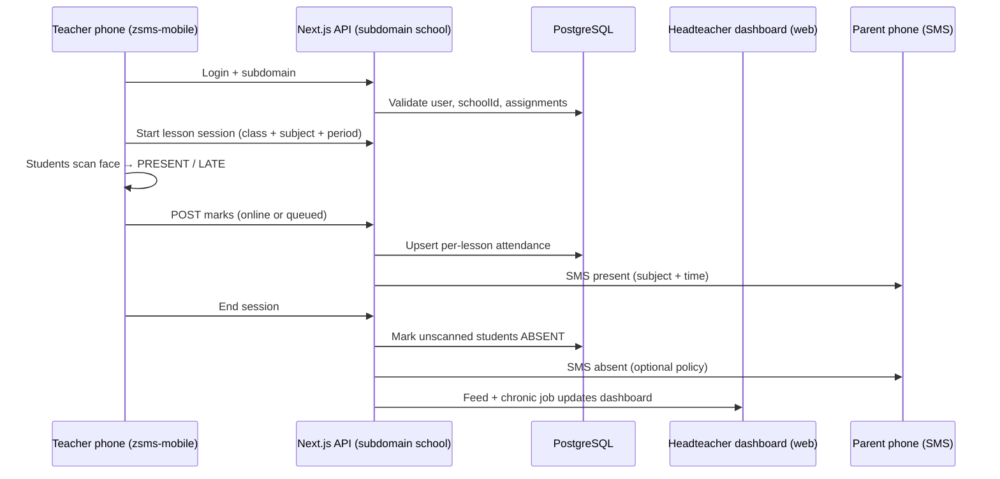

# ZSMS Mobile Attendance System — Zambia-Contextualised Full Architecture Expansion

### Bluepeack Technologies | ZSMS Product Document | 2025–2026

---

## Preface: Why Zambia Demands a Custom Architecture

A school management system built for the United Kingdom or the United States will fail in Zambia not because the engineers were bad, but because the **infrastructure assumptions are wrong**. The baseline architecture provided in the initial document is a solid foundation. This expansion document layers every major Zambian-specific dimension on top of it: the three-term calendar, the ECZ examination cycle, the dual-shift school system, load shedding, rural 2G-only connectivity, USSD for feature-phone parents, seven regional language SMS, boarding school logic, and the agricultural season absenteeism pattern.

Each section below is designed to slot directly into the existing Prisma schema, API layer, and mobile application.

---

## Section 1: Zambian Academic Calendar Integration

### 1.1 The Three-Term Structure

The Zambia Ministry of Education runs a **three-term academic year**, not a two-semester system. The 2025 schedule is:

| Term   | Opens           | Mid-Term Break | Closes        |
| ------ | --------------- | -------------- | ------------- |
| Term 1 | 13 January 2025 | Late February  | Early April   |
| Term 2 | Early May 2025  | Mid-July       | Mid-August    |
| Term 3 | September 2025  | October        | Late November |

> **New Curriculum Note:** From 2025, ECE Level 1, Grade 1, and the new **Form 1** (replacing Grade 8 under the new Zambia curriculum) open approximately four weeks later than other grades. Your `academicYear` and `term` fields in the `Attendance` model must account for this staggered start. Add a `termStartDate` and `termEndDate` to your school-level config table rather than hardcoding term numbers.

**Updated School Config Model:**

```prisma
model TermCalendar {
  id            String   @id @default(uuid())
  schoolId      String
  school        School   @relation(fields: [schoolId], references: [id])
  academicYear  String   // e.g., "2025/2026"
  term          Int      // 1, 2, or 3
  termStartDate DateTime
  termEndDate   DateTime
  midTermStart  DateTime?
  midTermEnd    DateTime?
  isActive      Boolean  @default(false)

  @@index([schoolId, academicYear])
}
```

---

### 1.2 The ECZ Examination Blackout Period

Every Term 3, the **Examinations Council of Zambia (ECZ)** administers national examinations for three cohorts simultaneously:

- **Grade 7** (end of primary school)
- **Grade 9 / Form 2** (end of junior secondary, under the new curriculum)
- **Grade 12 / Form 4** (end of senior secondary — the critical school-leaving certificate)

During the ECZ examination window (typically October–November), these three groups **do not attend normal lessons**. Standard biometric attendance sessions are suspended for examination candidates. Instead, an **Examination Hall Attendance Mode** must be activated.

**Examination Mode Logic:**

```typescript
// New enum value for attendance context
enum AttendanceContext {
  LESSON        // Normal class period
  EXAMINATION   // ECZ or school internal exam
  SPORTS_DAY    // School event
  ASSEMBLY      // Morning assembly register
}

// In the Attendance model, add:
attendanceContext  AttendanceContext @default(LESSON)
examPaperCode     String?           // e.g., "ECZ-MAT-7-2025" for Grade 7 Maths
```

**What the app should do during Examination Mode:**
The teacher (or invigilator) switches the session type to `EXAMINATION`. In this mode:

- The system does **not** fire parent SMS alerts for present students (parents of exam candidates already know their child is sitting).
- It **does** fire an SMS if a registered candidate is **absent from the examination hall** — this is a high-priority alert that must reach the Headteacher and parent within minutes.
- Biometric scanning still applies for identity verification (critical to prevent exam impersonation — a real concern flagged at Zambian schools).

---

### 1.3 Agricultural Season Absenteeism Warning System

Zambia's rainy/farming season runs from **November through April**, overlapping with Terms 1 and 3. Rural schools — especially those in Northern, Luapula, Eastern, and North-Western Provinces — experience sharp attendance drops during planting (November–December) and harvesting (March–April) as children assist families on the land.

Your timetable system already has an agricultural season warning flag. This must be extended into the **attendance analytics layer**:

```typescript
// Backend: seasonal absenteeism pattern detector
function detectSeasonalPattern(absences: AttendanceRecord[]): SeasonalFlag {
  const monthCounts = absences.reduce(
    (acc, record) => {
      const month = new Date(record.createdAt).getMonth() // 0-indexed
      acc[month] = (acc[month] || 0) + 1
      return acc
    },
    {} as Record<number, number>
  )

  // Planting season: Nov (10), Dec (11); Harvest: Mar (2), Apr (3)
  const farmingMonths = [10, 11, 2, 3]
  const farmingAbsences = farmingMonths.reduce((sum, m) => sum + (monthCounts[m] || 0), 0)
  const totalAbsences = Object.values(monthCounts).reduce((a, b) => a + b, 0)

  const ratio = totalAbsences > 0 ? farmingAbsences / totalAbsences : 0

  if (ratio > 0.6) return 'LIKELY_AGRICULTURAL' // >60% of absences in farming months
  return 'STANDARD'
}
```

The Headteacher dashboard should display a "Seasonal Risk" tag on students showing this pattern, so the school can engage the community rather than treating these as disciplinary absenteeism cases.

---

## Section 2: Zambian School Types & Dual-Shift System

### 2.1 School Types That Must Be Handled Differently

Zambia has several distinct school categories, each with different attendance logic:

| School Type        | Attendance Logic                 | Boarding? | Special Considerations                 |
| ------------------ | -------------------------------- | --------- | -------------------------------------- |
| Day School (Urban) | Per-period biometric             | No        | Standard flow                          |
| Day School (Rural) | Per-period, offline-first        | No        | Agricultural season flags              |
| Boarding School    | AM/PM plus dormitory roll call   | Yes       | Dormitory absence = safeguarding alert |
| Community School   | Simplified; fewer tech devices   | No        | USSD/SMS fallback critical             |
| Special Education  | Manual override always available | Mixed     | Biometrics may not be appropriate      |
| Private School     | Full feature set                 | Mixed     | May have own parent app                |

**Updated School Model:**

```prisma
enum SchoolType {
  DAY_URBAN
  DAY_RURAL
  BOARDING
  COMMUNITY
  SPECIAL_EDUCATION
  PRIVATE
}

model School {
  // ...existing fields...
  schoolType     SchoolType  @default(DAY_URBAN)
  province       String      // e.g., "Copperbelt", "Lusaka", "Eastern"
  district       String      // e.g., "Kitwe", "Ndola", "Chipata"
  isRural        Boolean     @default(false)
  hasBoarding    Boolean     @default(false)
  runsDualShift  Boolean     @default(false)
  shiftAStartTime String?    // e.g., "07:00" — Morning shift
  shiftBStartTime String?    // e.g., "12:30" — Afternoon shift
}
```

---

### 2.2 Dual-Shift Attendance Logic

Due to severe overcrowding — Zambian schools face overcrowded classrooms as one of the factors impeding effective learning — many urban schools in Lusaka, Kitwe, Ndola, and Kabwe run **double shifts**: the same building hosts two separate school populations. Shift A (morning) and Shift B (afternoon) are functionally independent schools sharing infrastructure.

Your `AttendanceSession` must know which shift it belongs to, because:

- A teacher from Shift A scanning at 14:00 would be flagged as an anomaly.
- Reporting must aggregate shift A and shift B **separately** on the Headteacher dashboard.
- Parent SMS messages must include the shift: _"Your child Mwansa is attending Mathematics in the Morning Shift at 08:15."_

```prisma
enum SchoolShift {
  SINGLE   // Standard full-day school
  SHIFT_A  // Morning session (approx 07:00–12:00)
  SHIFT_B  // Afternoon session (approx 12:30–17:30)
}

// Add to Attendance model:
shift  SchoolShift  @default(SINGLE)
```

---

### 2.3 Boarding School Dormitory Roll Call

For boarding schools (a significant portion of Zambia's secondary schools, particularly government grant-aided schools), the attendance system must support an additional roll call event: the **nightly dormitory register**. A student who skips a lesson is a pastoral concern; a student absent from the dormitory at 21:00 is a **safeguarding emergency**.

```prisma
enum RollCallType {
  LESSON_PERIOD     // Academic class
  MORNING_ASSEMBLY  // Daily assembly before lessons
  DORMITORY_NIGHT   // Boarding school: 21:00 roll call
  WEEKEND_SIGN_OUT  // Student officially signed out to family
}

// This replaces attendanceContext in the full model:
rollCallType  RollCallType  @default(LESSON_PERIOD)

// Dormitory-specific
dormitoryId   String?
dormitory     Dormitory?    @relation(fields: [dormitoryId], references: [id])
```

**Dormitory Absence Alert Escalation:**

```typescript
async function handleDormitoryAbsence(studentId: string, schoolId: string) {
  // Level 1: Immediate push notification to Housemaster/Housemistress
  await notifyHousemaster(studentId, schoolId)

  // Level 2: After 30 minutes unresolved, notify Headteacher + Deputy
  setTimeout(
    async () => {
      const stillMissing = await checkIfResolved(studentId)
      if (stillMissing) {
        await notifyHeadteacher(studentId, schoolId, 'DORMITORY_EMERGENCY')
        // Level 3: SMS to both parents AND guardian simultaneously
        await triggerParentSMS(studentId, 'DORMITORY_MISSING', { priority: 'URGENT' })
      }
    },
    30 * 60 * 1000
  )
}
```

---

## Section 3: Zambian Connectivity Architecture (The Real Infrastructure)

### 3.1 The True Connectivity Picture

As of 2025, Zambia's connectivity is highly stratified:

- Zambia has an internet penetration rate of approximately 21%, representing around 4.3 million internet users from a population of over 20 million.
- Airtel accounts for about 56% of internet-enabled SIMs, MTN about 28%, together approximately 84%, with Zamtel around 7%.
- USSD remained the dominant technology in the African mobile money market, capturing 63.5% of total transaction volume in 2024, sustained by its compatibility with basic feature phones and operation on 2G networks.

This means: a significant proportion of **parents receiving notifications do NOT have smartphones**. They use feature phones on 2G. Your SMS architecture is correct, but it is not sufficient alone.

### 3.2 Three-Tier Communication Strategy

The system must attempt parent notification through a **waterfall of channels**, in order of what is most likely to reach a Zambian parent:

```
Tier 1 — SMS (AfricasTalking → Airtel/MTN/Zamtel)
  ↓ If parent has a smartphone registered with a WhatsApp number:
Tier 2 — WhatsApp Business API (Cloud API via Meta)
  ↓ If internet-connected school has parent email:
Tier 3 — Email (for urban school admin/professional parents only)
```

**Why WhatsApp is important in Zambia:** WhatsApp is by far the most-used communication platform in urban and peri-urban Zambia. Parent school groups, teacher-parent communication, and even Ministry circulars now move primarily through WhatsApp. Adding a `whatsappNumber` field to the parent profile and integrating the **WhatsApp Business Cloud API** (which is free for the first 1,000 conversations/month) is not optional for urban schools — it is expected.

```prisma
model StudentGuardian {
  id                  String   @id @default(uuid())
  studentId           String
  student             Student  @relation(fields: [studentId], references: [id])

  // Contact details
  motherName          String?
  motherPhone         String?  // MTN/Airtel/Zamtel format: +26097XXXXXXX
  motherWhatsApp      String?  // May differ from voice number
  fatherName          String?
  fatherPhone         String?
  fatherWhatsApp      String?
  guardianName        String?
  guardianPhone       String?
  guardianWhatsApp    String?

  // Preferred language for notifications (critical for Zambia)
  preferredLanguage   NotificationLanguage @default(ENGLISH)

  // Preferred channel
  preferredChannel    NotificationChannel  @default(SMS)

  // Network operator (auto-detect from phone prefix, or manually set)
  motherNetwork       ZambiaNetwork?
  fatherNetwork       ZambiaNetwork?
}

enum ZambiaNetwork {
  MTN      // Prefix: 096, 076
  AIRTEL   // Prefix: 097, 077
  ZAMTEL   // Prefix: 095
}

enum NotificationLanguage {
  ENGLISH
  BEMBA
  NYANJA
  TONGA
  LOZI
  KAONDE
  LUVALE
  LUNDA
}

enum NotificationChannel {
  SMS
  WHATSAPP
  EMAIL
}
```

---

### 3.3 Network Auto-Detection from Phone Number

Zambia's mobile number prefixes are predictable. Your backend should **auto-detect the parent's operator** from the phone number they register, to allow intelligent routing (e.g., use AfricasTalking's local Zambia route for Airtel, and MTN-specific routes for MTN numbers):

```typescript
function detectZambiaNetwork(phone: string): ZambiaNetwork {
  // Normalize to local format
  const digits = phone.replace(/^\+260/, '0').replace(/\s/g, '')

  if (digits.startsWith('096') || digits.startsWith('076')) return 'MTN'
  if (digits.startsWith('097') || digits.startsWith('077')) return 'AIRTEL'
  if (digits.startsWith('095')) return 'ZAMTEL'

  throw new Error(`Unrecognised Zambia network prefix for: ${phone}`)
}
```

---

### 3.4 USSD Fallback: The Feature Phone Parent Portal

For parents on **feature phones with no smartphone**, build a USSD self-service portal using **AfricasTalking's USSD API**, which supports Airtel, MTN, and Zamtel in Zambia. This allows any parent to dial a short code (e.g., `*384*ZSMS#`) and check their child's attendance without needing data or a smartphone.

```
*384*ZSMS# → Welcome to ZSMS
  1. Check My Child's Attendance
  2. Report Child Absence
  3. Contact School Office

  → Option 1 →
  Enter your child's Student ID:
  → [Parent enters e.g. 20241023]

  → "Mwansa Chanda | Form 3B
     Today: PRESENT (Maths 08:00 ✓, English 09:00 ✓)
     This Term: 47 Present | 3 Absent | 0 Late"
```

**Node.js USSD Handler (AfricasTalking):**

```typescript
app.post('/ussd', async (req, res) => {
  const { sessionId, serviceCode, phoneNumber, text } = req.body
  const input = text.split('*')
  let response = ''

  if (text === '') {
    response = `CON Welcome to ZSMS - Zambia School Management System\n1. Check Child Attendance\n2. Report Absence\n3. Contact School`
  } else if (input[0] === '1' && input.length === 1) {
    response = `CON Enter your child's Student ID number:`
  } else if (input[0] === '1' && input.length === 2) {
    const studentId = input[1]
    const record = await getAttendanceSummary(studentId, phoneNumber) // verify parent phone
    if (!record) {
      response = `END Student not found or you are not registered as a guardian for this student. Contact school office.`
    } else {
      response = `END ${record.name} | ${record.class}\nToday: ${record.todayStatus}\nThis Term: ${record.present} Present | ${record.absent} Absent`
    }
  } else if (input[0] === '2') {
    response = `END Your absence report has been sent to the class teacher. The school will follow up.`
    await logParentAbsenceReport(phoneNumber, input[1])
  } else {
    response = `END Contact school office: ${await getSchoolPhone(phoneNumber)}`
  }

  res.set('Content-Type', 'text/plain')
  res.send(response)
})
```

---

## Section 4: Seven-Language SMS Notification System

Zambia has **seven officially recognized regional/provincial languages** alongside English as the official national language: Bemba (Northern/Copperbelt), Nyanja (Lusaka/Eastern), Tonga (Southern), Lozi (Western), Kaonde (North-Western), Luvale (North-Western), and Lunda (North-Western/Luapula).

Parents in rural schools — especially government basic schools — are far more responsive to messages in their mother tongue than in English. Build a **localized SMS template engine**:

```typescript
const smsTemplates: Record<NotificationLanguage, SMSTemplates> = {
  ENGLISH: {
    present: (name, subject, time) =>
      `ZSMS: ${name} is in class. Subject: ${subject} at ${time}. Reply HELP to contact school.`,
    absent: (name, subject) =>
      `ZSMS ALERT: ${name} was marked ABSENT from ${subject} today. Contact school: {phone}.`,
    chronic: (name, count) =>
      `ZSMS URGENT: ${name} has been absent ${count} times this term. Please call school urgently.`,
  },
  BEMBA: {
    present: (name, subject, time) =>
      `ZSMS: ${name} ali mu class. Icifukwa: ${subject} pa ${time}. Tuma HELP ukafwanya ischool.`,
    absent: (name, subject) =>
      `ZSMS AMAKA: ${name} tabonalikwa mu ${subject} lelo. Fumbana na ischool: {phone}.`,
    chronic: (name, count) =>
      `ZSMS YABIPA: ${name} tabonalikwa ${count} inshiku uno mweshi. Ifumine ischool nokwangula.`,
  },
  NYANJA: {
    present: (name, subject, time) =>
      `ZSMS: ${name} ali mu kalasi. Tekiniko: ${subject} pa ${time}. Tumiza HELP kukumana ndi sukulu.`,
    absent: (name, subject) =>
      `ZSMS CHENJEZO: ${name} sanasonyeze mu ${subject} lero. Lankhulani ndi sukulu: {phone}.`,
    chronic: (name, count) =>
      `ZSMS CHINDANI: ${name} wabwerera ${count} nthawi izi. Funsani sukulu mwamsanga.`,
  },
  TONGA: {
    present: (name, subject, time) =>
      `ZSMS: ${name} uli mu kalasi. Sika: ${subject} ku ${time}. Tuma HELP kwaamba ischool.`,
    absent: (name, subject) =>
      `ZSMS CHIBUZYO: ${name} takabonaniki mu ${subject} lelo. Yumba ischool: {phone}.`,
    chronic: (name, count) =>
      `ZSMS MUYOYO: ${name} kakazyizyi ${count} mazuba. Yumba ischool nokwaba.`,
  },
  // LOZI, KAONDE, LUVALE, LUNDA: Add translations with local language specialists
  LOZI: {
    present: (name, subject, time) => `ZSMS: ${name} u fa sikolo. Sifundo: ${subject} ka ${time}.`,
    absent: (name, subject) =>
      `ZSMS KALAFO: ${name} ha si bonwi ku ${subject} kacenu. Bilaeza sikolo: {phone}.`,
    chronic: (name, count) => `ZSMS BUTATA: ${name} u zwezipili ${count} mazazi. Bilaeza sikolo.`,
  },
  KAONDE: { present: () => '', absent: () => '', chronic: () => '' }, // Placeholder
  LUVALE: { present: () => '', absent: () => '', chronic: () => '' },
  LUNDA: { present: () => '', absent: () => '', chronic: () => '' },
}

// Always keep messages under 160 characters for standard SMS rate — special characters (e.g. Bemba diacritics)
// drop the limit to 70 characters per segment. Validate before sending.
function validateSMSLength(message: string): boolean {
  const hasSpecialChars = /[^\x00-\x7F]/.test(message)
  const limit = hasSpecialChars ? 70 : 160
  if (message.length > limit) {
    console.warn(
      `SMS too long (${message.length} chars, limit ${limit}). Will send as concatenated.`
    )
  }
  return message.length <= limit
}
```

> **Important:** The Bemba, Nyanja, Tonga, and Lozi template translations above are functional starting points but should be **reviewed and refined by native speakers** before production deployment. Work with the Zambia Institute of Languages or a local translator. Inaccurate mother-tongue messages erode trust faster than English-only messages.

---

## Section 5: ZESCO Load Shedding & Device Resilience

Zambia's national power utility ZESCO runs scheduled load shedding — rolling blackouts that in recent years have reached 8–16 hours per day in some areas. This creates two direct failure modes for your system:

1. **The teacher's phone dies mid-session** — battery ran out because no power at home to charge.
2. **The school's Wi-Fi router is off** — no sync possible even if phones are charged.

### 5.1 Battery-Aware Session Management

```typescript
// On the @zsms-mobile app, monitor battery level before starting a session
async function checkDeviceReadiness(): Promise<ReadinessCheck> {
  const battery = await navigator.getBattery() // Web/PWA API

  return {
    batteryLevel: battery.level, // 0.0 to 1.0
    isCharging: battery.charging,
    warning:
      battery.level < 0.2 && !battery.charging
        ? 'LOW_BATTERY' // Warn teacher: phone at <20%, may not complete session
        : null,
    critical:
      battery.level < 0.1 && !battery.charging
        ? 'CRITICAL_BATTERY' // Lock new sessions; finish current one only
        : null,
  }
}
```

**Session Auto-Save Interval:**
The mobile app must auto-save attendance progress locally every **30 seconds**, not just on "End Session". If the phone dies mid-session, the last saved state is recoverable on reopen.

```typescript
// Aggressive local persistence
setInterval(() => {
  localStorage.setItem(`session_draft_${sessionId}`, JSON.stringify(currentAttendanceState))
}, 30_000)
```

---

### 5.2 School-Level Solar/UPS Status Indicator

For schools with solar panels or UPS systems (increasingly common under government and NGO programmes), add a power status flag that the School IT Admin can set each morning:

```prisma
model SchoolPowerStatus {
  id          String   @id @default(uuid())
  schoolId    String
  date        DateTime @default(now())
  powerSource PowerSource
  expectedOutageHours Int? // How many hours of load shedding expected today

  @@index([schoolId, date])
}

enum PowerSource {
  ZESCO_GRID    // Normal ZESCO power — stable
  SOLAR_BACKUP  // Running on solar/battery — limited load
  GENERATOR     // Generator power — likely limited hours
  NO_POWER      // Complete outage — offline mode mandatory
}
```

When `NO_POWER` is set, the backend should proactively push a sync command to all teacher devices to download the day's rosters **immediately** (while they still have mobile data), before they lose the ability to sync.

---

## Section 6: Zambian Grade/Form Naming in the New Curriculum

The Ministry of Education is transitioning from the old Grade 8–12 numbering to a **Form 1–6 system** as part of the new curriculum rollout. Your database must support **both naming conventions** during the transition period and eventually display the correct one per school's adoption status:

```prisma
enum GradeSystem {
  LEGACY  // Grade 1–7 (primary), Grade 8–12 (secondary) — old system
  NEW     // Grade 1–7 (primary), Form 1–6 (secondary) — new curriculum
}

model Class {
  // ...existing fields...
  gradeLevel      Int       // Numeric: 1–12 (primary + secondary range)
  gradeName       String    // Display: "Grade 7", "Form 3", "Form 4B"
  gradeSystem     GradeSystem @default(NEW)
  isECZCohort     Boolean   @default(false) // Grade 7 / Form 2 / Form 4 — ECZ exam year
}
```

**Grade-to-ECZ Mapping:**

```typescript
const ECZ_EXAMINATION_GRADES = {
  GRADE_7: { name: 'Primary School Leaving', examMonth: [10, 11] }, // Oct–Nov
  FORM_2: { name: 'Junior Secondary Certificate', examMonth: [10, 11] },
  FORM_4: { name: 'School Certificate (GCE)', examMonth: [10, 11] },
}
```

---

## Section 7: Community School Simplified Mode

Rural Zambia faces the most obstacles in keeping children in school, with few schools, often far from students' homes, and transportation costs prohibitive for rural families. Many community schools in these areas are managed by parent committees, have minimal trained staff, and may have **one shared device** for the entire school. These schools need a radically simplified UI mode.

### 7.1 Community School Mode

When `schoolType = COMMUNITY`, the `@zsms-mobile` app should activate a stripped-down interface:

- **No facial recognition** (biometric enrollment is impractical for community schools with limited device time)
- **Simple name-tap roll call**: Teacher scrolls a list of student names and taps Present/Absent/Late
- **Bulk absent**: "Mark All Absent, then tap who is Present" (faster when most students are absent)
- **Voice confirmation** (optional): For teachers with low literacy in English, use Zambia-localized text-to-speech to read out student names in Bemba or Nyanja
- **Paper backup export**: Generate a printable PDF attendance sheet that matches the digital record, for districts that require paper submission to the District Education Board Office (DEBO)

```typescript
// Community mode attendance — no biometrics
interface CommunityAttendanceSession {
  mode: 'COMMUNITY_SIMPLE'
  sessionId: string
  teacherId: string
  classId: string
  roster: { studentId: string; name: string; status: 'PRESENT' | 'ABSENT' | 'LATE' }[]
  verificationMethod: 'MANUAL' // Always manual in community mode
}
```

---

## Section 8: District Education Board Office (DEBO) Reporting Integration

In Zambia, every school submits attendance statistics to their **District Education Board Office (DEBO)**. These reports are typically submitted monthly on paper forms. ZSMS should automate this reporting layer, turning a manual, error-prone process into a one-tap export.

### 8.1 DEBO Monthly Report Auto-Generation

```typescript
async function generateDEBOMonthlyReport(schoolId: string, month: number, year: number) {
  const school = await prisma.school.findUnique({
    where: { id: schoolId },
    include: { district: true, province: true },
  })

  // Aggregate per-class, per-subject attendance totals
  const attendanceSummary = await prisma.attendance.groupBy({
    by: ['classId', 'status'],
    where: {
      schoolId,
      createdAt: {
        gte: new Date(year, month - 1, 1),
        lt: new Date(year, month, 1),
      },
    },
    _count: { status: true },
  })

  // Format to match MOE Form 60 (the standard Zambia attendance return form)
  return {
    schoolName: school.name,
    province: school.province,
    district: school.district,
    reportingMonth: `${year}-${String(month).padStart(2, '0')}`,
    totalEnrolled: await getEnrollmentCount(schoolId),
    attendanceSummary,
    generatedAt: new Date().toISOString(),
    signature: null, // Headteacher signs the PDF version
  }
}
```

The report can be exported as a **printable PDF** (for manual submission) or, as DEBO offices increasingly move online, as a **JSON POST** to the Ministry's EMIS (Education Management Information System) endpoint when one is made available.

---

## Section 9: Zambia-Specific Headteacher Dashboard Panels

Beyond the baseline chronic absenteeism panel, the Headteacher dashboard needs the following **Zambia-specific analytical panels**:

### Panel A: Provincial Comparison Benchmark

If the school is part of a multi-school network (e.g., a mission society running 10 schools across Eastern Province), the Headteacher should see how their school's attendance rate compares against **same-district and same-province benchmarks**:

```typescript
// Aggregate attendance rate per school within a province
const provinceBenchmark = await prisma.$queryRaw`
  SELECT 
    s.name AS school_name,
    s.district,
    COUNT(CASE WHEN a.status = 'PRESENT' THEN 1 END)::float /
    NULLIF(COUNT(a.id), 0) * 100 AS attendance_rate
  FROM "Attendance" a
  JOIN "School" s ON a."schoolId" = s.id
  WHERE s.province = ${school.province}
    AND a."academicYear" = ${currentAcademicYear}
    AND a.term = ${currentTerm}
  GROUP BY s.id, s.name, s.district
  ORDER BY attendance_rate DESC
`
```

### Panel B: Dual-Shift Discrepancy Alert

If a school runs dual shifts and Shift B (afternoon) consistently shows significantly lower attendance than Shift A (morning), this is a systemic issue — potentially the afternoon shift lacks adequate teacher coverage or parents pull children home before the afternoon shift starts:

```typescript
const shiftDiscrepancy = await prisma.attendance.groupBy({
  by: ['shift'],
  where: { schoolId, academicYear: currentYear, term: currentTerm },
  _count: { status: true },
  having: {
    status: {
      _count: { lt: shiftA_count * 0.8 }, // Flag if Shift B <80% of Shift A
    },
  },
})
```

### Panel C: ECZ Candidate At-Risk Tracker

For Form 4 and Grade 7 students sitting national examinations, chronic absenteeism becomes **urgent** — a student who misses too many lessons before ECZ exams may not be permitted to sit (schools can withdraw candidates for non-attendance). This panel highlights ECZ candidates crossing the 5-absence threshold at least **4 weeks before examinations begin**, allowing intervention time:

```typescript
const ecCandidatesAtRisk = await prisma.attendance.groupBy({
  by: ['studentId'],
  where: {
    schoolId,
    status: 'ABSENT',
    student: { class: { isECZCohort: true } },
    academicYear: currentYear,
    term: currentTerm,
  },
  _count: { status: true },
  having: { status: { _count: { gte: 4 } } }, // Lower threshold for ECZ cohort
  orderBy: { _count: { status: 'desc' } },
})
```

---

## Section 10: Safeguarding & Child Protection Context

Zambia's Child Code Act (2022) and the Ministry of Education's Child Safeguarding Policy place specific legal obligations on schools. Your ZSMS attendance system touches on several of these:

### 10.1 Mandatory Safeguarding Flags

```prisma
enum SafeguardingFlag {
  NONE
  AT_RISK         // General welfare concern
  DOMESTIC_ISSUE  // Known home situation concern
  GENDER_RISK     // Girls at risk of early marriage/pregnancy (MOE tracks this separately)
  ORPHAN_DOUBLE   // Double orphan (both parents deceased) — common in Zambia
  OVC             // Orphan and Vulnerable Child on social welfare
}

// Add to Student model:
safeguardingFlag  SafeguardingFlag  @default(NONE)
ovcCaseNumber     String?           // Government OVC case reference
socialWorkerName  String?
socialWorkerPhone String?
```

When a student flagged as `OVC` or `AT_RISK` crosses the 3-absence threshold (lower than the standard 5), the system should notify both the Headteacher **and** the designated school-level Child Rights Corner (CRC) Teacher, who is mandated by MOE policy to follow up.

### 10.2 Gender Disaggregated Reporting

The Ministry of Education's gender tracking requirements mean all attendance analytics should default to **gender-disaggregated views**. The Headteacher dashboard's "Chronic Absenteeism" panel must show:

```
At-Risk Students This Term: 12
  ├── Boys:  7  (avg 6.2 absences)
  └── Girls: 5  (avg 7.4 absences)
```

A significantly higher girl absence rate triggers a **Gender Parity Alert** that the Headteacher is expected to report to the District Gender Focal Point.

---

## Section 11: Complete Updated Prisma Schema Summary

The following is a consolidated schema showing all new Zambia-specific additions, designed to slot into your existing ZSMS `schema.prisma`:

```prisma
// =====================================================
// ZAMBIA-SPECIFIC EXTENSIONS TO ZSMS SCHEMA
// =====================================================

enum ZambiaNetwork     { MTN AIRTEL ZAMTEL }
enum NotificationLanguage { ENGLISH BEMBA NYANJA TONGA LOZI KAONDE LUVALE LUNDA }
enum NotificationChannel  { SMS WHATSAPP EMAIL USSD }
enum SchoolType    { DAY_URBAN DAY_RURAL BOARDING COMMUNITY SPECIAL_EDUCATION PRIVATE }
enum SchoolShift   { SINGLE SHIFT_A SHIFT_B }
enum RollCallType  { LESSON_PERIOD MORNING_ASSEMBLY DORMITORY_NIGHT WEEKEND_SIGN_OUT }
enum AttendanceContext { LESSON EXAMINATION SPORTS_DAY ASSEMBLY }
enum GradeSystem   { LEGACY NEW }
enum SafeguardingFlag { NONE AT_RISK DOMESTIC_ISSUE GENDER_RISK ORPHAN_DOUBLE OVC }
enum PowerSource   { ZESCO_GRID SOLAR_BACKUP GENERATOR NO_POWER }
enum SeasonalFlag  { STANDARD LIKELY_AGRICULTURAL CONFIRMED_AGRICULTURAL }

// EXTEND: School
// schoolType, province, district, isRural, hasBoarding, runsDualShift,
// shiftAStartTime, shiftBStartTime

// EXTEND: Class
// gradeLevel, gradeName, gradeSystem, isECZCohort, shift

// EXTEND: Student
// safeguardingFlag, ovcCaseNumber, socialWorkerName, socialWorkerPhone, gender

// EXTEND: Attendance
// shift, rollCallType, attendanceContext, examPaperCode,
// seasonalFlag, dormitoryId

// NEW MODELS:
// TermCalendar, StudentGuardian, SchoolPowerStatus, Dormitory
```

---

## Section 12: AfricasTalking Zambia Configuration Checklist

Before going to production with your SMS layer, complete these AfricasTalking Zambia-specific steps:

AfricasTalking supports Zambia for both Airtel and SMS termination, and Airtel identifies traffic as international when your Sender ID represents a brand that terminates messages to more than one country. Therefore:

1. **Register a Zambia-specific Sender ID** (e.g., `ZSMS-ZM` or `BLUEPEACK`) — do not share the Sender ID across countries.
2. AfricasTalking provides USSD API services for Zamtel in Zambia, meaning USSD works on all three networks.
3. Register a **shared USSD shortcode** on AfricasTalking for the parent self-service portal — shared codes are cheaper than dedicated ones and sufficient for ZSMS's volume.
4. Set up a **Zambia-local DLR (Delivery Receipt)** webhook so your backend can confirm which parent SMSes were actually delivered and retry failed ones on a secondary route.
5. Budget approximately **ZMW 0.15–0.30 per SMS** for Zambia domestic delivery, depending on volume tier.

---

## Section 13: Core Product Integration — Web + `@zsms-mobile` + Headteacher Dashboard

This section maps the **product requirements** (mobile attendance with face recognition, auto-absent, parent SMS, chronic reporting) onto the **same PostgreSQL database** as the main Next.js school management system. It is the implementation blueprint; Sections 1–12 above add Zambia-specific context on top.

**Companion spec:** [`mobile-app.md`](./mobile-app.md) (auth, API routes, offline queue).

### 13.1 Single source of truth (multi-tenant by subdomain)

| Requirement                     | How it works                                                                                                                                                 |
| ------------------------------- | ------------------------------------------------------------------------------------------------------------------------------------------------------------ |
| Same database                   | `@zsms-mobile` calls Next.js APIs only; all writes go to `DATABASE_URL` via Prisma (`lib/prisma.ts`). No separate mobile DB.                                 |
| Same school                     | Teacher enters **subdomain** at login → `POST /api/mobile/auth/login` resolves `schoolId` → JWT carries `schoolId`. Header `x-school-subdomain` is a backup. |
| Same students                   | Roster from `GET /api/mobile/class-roster` uses `Student`, `Class`, `PupilSubjectEnrollment` — same records as the web app.                                  |
| Same teachers / HODs / subjects | `GET /api/mobile/session-context` returns **teaching assignments** (class + subject) from the same allocation tables the web timetable uses.                 |
| Headteacher visibility          | Web dashboard reads the same `Attendance` / session tables the mobile app writes (see §16).                                                                  |



### 13.2 Critical schema gap (must fix before per-period attendance)

**Today:** `Attendance` has `@@unique([studentId, date])` — **one row per learner per calendar day**, no `subjectId`, `period`, or `teacherId`.

**Target:** Per-**lesson session** marks so the Headteacher sees “who was in Mathematics Period 2” and chronic rules count **misses per subject per term**.

**Migration direction:**

```prisma
model AttendanceSession {
  id            String   @id @default(cuid())
  schoolId      String
  teacherId     String   // User.id of teacher running session
  classId       String
  subjectId     String
  term          Int
  academicYear  String
  periodLabel   String?  // e.g. "Period 2", slot from timetable
  shift         SchoolShift @default(SINGLE)
  startedAt     DateTime @default(now())
  endedAt       DateTime?
  status        SessionStatus @default(OPEN) // OPEN | CLOSED
  verificationMethod VerificationMethod @default(FACE)

  school   School  @relation(fields: [schoolId], references: [id])
  marks    AttendanceMark[]

  @@index([schoolId, startedAt])
  @@index([teacherId, status])
}

model AttendanceMark {
  id          String   @id @default(cuid())
  sessionId   String
  studentId   String
  schoolId    String
  status      AttendanceStatus // PRESENT | LATE | ABSENT | EXCUSED
  markedAt    DateTime @default(now())
  method      VerificationMethod // FACE | FINGERPRINT | MANUAL | TWIN_OVERRIDE
  faceMatchScore Float?
  remarks     String?

  session AttendanceSession @relation(fields: [sessionId], references: [id], onDelete: Cascade)
  student Student @relation(fields: [studentId], references: [id])

  @@unique([sessionId, studentId])
  @@index([schoolId, studentId])
}

enum SessionStatus { OPEN CLOSED }
enum AttendanceStatus { PRESENT LATE ABSENT EXCUSED }
enum VerificationMethod { FACE FINGERPRINT MANUAL TWIN_OVERRIDE COMMUNITY_TAP }
```

Keep the legacy `Attendance` model temporarily for daily registers / DEBO exports, or migrate reports to aggregate from `AttendanceMark`.

### 13.3 Teacher mobile flow (end-to-end)

| Step | Actor       | Behaviour                                                                                                              |
| ---- | ----------- | ---------------------------------------------------------------------------------------------------------------------- |
| 1    | Teacher     | Opens `@zsms-mobile`, selects school subdomain, logs in.                                                               |
| 2    | Teacher     | Picks **assigned class + subject** (only their allocations from `session-context`).                                    |
| 3    | System      | Loads roster: learners enrolled in that subject for that class (`class-roster` + `includeFaceData=true`).              |
| 4    | Teacher     | Starts **session** → `POST /api/mobile/attendance/sessions` → `OPEN`.                                                  |
| 5    | Learners    | Each pupil scans face on teacher’s phone; app compares embedding to `Student.faceEmbedding` (on-device ML Kit).        |
| 6    | System      | Match → `PRESENT`; after grace window → `LATE`; store `faceMatchScore`.                                                |
| 7    | Twins       | If `Student.twinGroupId` set: first twin present blocks second until **fingerprint** (or PIN) confirms identity (§15). |
| 8    | Teacher     | Taps **End session** → server marks all roster pupils without a mark as `ABSENT` (§14).                                |
| 9    | API         | Persists marks, closes session, triggers parent SMS (present already sent on scan; absent on close if policy says so). |
| 10   | Headteacher | Web dashboard shows session summary and chronic alerts (§16).                                                          |

**Offline:** Queue session + marks in AsyncStorage; flush via `POST /api/mobile/sync` (extend payload to include `sessions` + `marks`, not only legacy daily records).

### 13.4 API surface to add (Next.js)

| Method  | Route                                           | Purpose                                                |
| ------- | ----------------------------------------------- | ------------------------------------------------------ |
| `POST`  | `/api/mobile/attendance/sessions`               | Open session (classId, subjectId, period, shift)       |
| `PATCH` | `/api/mobile/attendance/sessions/[id]/close`    | End session → auto-absent + SMS batch                  |
| `POST`  | `/api/mobile/attendance/sessions/[id]/marks`    | Single mark (face verify result)                       |
| `POST`  | `/api/mobile/attendance/verify-face`            | Optional server-side re-verify (high-security schools) |
| `GET`   | `/api/dashboard/headteacher/attendance/live`    | Today’s sessions, rates by period/class                |
| `GET`   | `/api/dashboard/headteacher/attendance/chronic` | Pupils with ≥5 subject absences in term                |
| `GET`   | `/api/dashboard/teacher/attendance/chronic`     | Same filter scoped to logged-in teacher’s subjects     |

Existing routes to **keep using**:

- `POST /api/students/[id]/face-enrollment` — admin/headteacher enrolls embedding at registration.
- `GET /api/mobile/class-roster?includeFaceData=true` — mobile downloads embeddings once per session (cache encrypted locally).
- `POST /api/attendance` — legacy daily register (web); deprecate for lesson flow once session model ships.

**SMS:** Reuse `lib/sms.js` (`buildAttendanceSmsMessage`, AfricasTalking). Call from **session mark** and **session close** handlers. Extend `POST /api/mobile/sync` to invoke the same SMS helpers (today SMS only runs on web `POST /api/attendance`).

Parent phone fields (already on `Student`): `parent_mother_contact`, `parent_father_contact`, `guardian_contact` — normalize with existing `normalizePhoneNumbers`.

---

## Section 14: Session lifecycle — Present, Late, Auto-Absent

### 14.1 Timing rules

```typescript
interface SessionConfig {
  lateAfterMinutes: number // e.g. 10 after session start
  presentSmsOnScan: boolean // default true
  absentSmsOnClose: boolean // default true for premium schools
}

async function closeAttendanceSession(sessionId: string) {
  const session = await prisma.attendanceSession.findUnique({
    where: { id: sessionId },
    include: { marks: true },
  })
  const roster = await getSubjectRoster(session.classId, session.subjectId, session.schoolId)
  const markedIds = new Set(session.marks.map((m) => m.studentId))

  const absentPupils = roster.filter((s) => !markedIds.has(s.id))
  await prisma.$transaction([
    ...absentPupils.map((s) =>
      prisma.attendanceMark.create({
        data: {
          sessionId,
          studentId: s.id,
          schoolId: session.schoolId,
          status: 'ABSENT',
          method: 'MANUAL', // system-closed
        },
      })
    ),
    prisma.attendanceSession.update({
      where: { id: sessionId },
      data: { status: 'CLOSED', endedAt: new Date() },
    }),
  ])

  await notifyHeadteacherSessionClosed(session)
  await sendAbsentSmsBatch(absentPupils, session)
}
```

### 14.2 `@zsms-mobile` behaviour changes

| Current behaviour                                                     | Required behaviour                                                    |
| --------------------------------------------------------------------- | --------------------------------------------------------------------- |
| Manual chips only; no camera                                          | **Face scan screen** after session start                              |
| `attendanceStore` defaults missing pupils to **present** on save      | Only explicit scans = present/late; **end session** = absent          |
| `loadExistingAttendance` reads wrong JSON shape (`records` vs `data`) | Fix parser; load marks for **sessionId** not only daily date          |
| No `src/storage/secure.ts`                                            | Add expo-secure-store for tokens + cached embeddings                  |
| Offline queue sends daily records only                                | Queue `session` + `marks`; sync endpoint merges into `AttendanceMark` |

### 14.3 Present / late SMS (parent notification)

Template (English baseline; plug in §4 languages via `StudentGuardian.preferredLanguage` when that model exists):

```
ZSMS: {studentName} is in class. Subject: {subjectName} at {time}. Reply HELP to contact school.
```

Send on **successful face verify** (`PRESENT` or `LATE`), gated by school plan (same check as `app/api/attendance/route.js` today).

---

## Section 15: Face recognition and identical-twin safeguards

### 15.1 Enrollment (web / admin)

1. Headteacher or admin registers pupil → capture **3–5 face angles** → average embedding → `Student.faceEmbedding` (JSON float array).
2. If registrar flags **identical twin**: set `twinGroupId` (shared UUID on both siblings) and `requiresSecondaryAuth: true`.

```prisma
// Extend Student
twinGroupId              String?
requiresSecondaryAuth    Boolean @default(false)
secondaryAuthMethod      SecondaryAuthMethod? // FINGERPRINT | PIN | NONE
fingerprintTemplateRef   String?  // opaque id in secure vault, not raw image in DB
pinHash                  String?  // bcrypt of parent-set PIN for twin disambiguation

enum SecondaryAuthMethod { FINGERPRINT PIN NONE }
```

### 15.2 Lesson-time logic

```typescript
async function markAttendanceByFace(
  sessionId: string,
  scannedStudentId: string,
  matchScore: number,
  secondaryAuth?: { method: 'FINGERPRINT' | 'PIN'; verified: boolean }
) {
  const student = await prisma.student.findUnique({ where: { id: scannedStudentId } })
  if (matchScore < FACE_THRESHOLD) throw new Error('Face not recognised')

  if (student.twinGroupId) {
    const twinPresent = await prisma.attendanceMark.findFirst({
      where: {
        sessionId,
        student: { twinGroupId: student.twinGroupId },
        status: { in: ['PRESENT', 'LATE'] },
        studentId: { not: scannedStudentId },
      },
    })
    if (twinPresent && !secondaryAuth?.verified) {
      // Block: mark scanned twin ABSENT until fingerprint/PIN proves identity
      throw new Error('TWIN_SECONDARY_AUTH_REQUIRED')
    }
  }

  const status = isLate(sessionId) ? 'LATE' : 'PRESENT'
  await createMark({
    sessionId,
    studentId: scannedStudentId,
    status,
    method: 'FACE',
    faceMatchScore: matchScore,
  })
  await sendPresentSms(student, session)
}
```

**Product rule:** When one twin is marked present without secondary auth, the **other twin in the same session must remain absent** until they complete their own scan + fingerprint/PIN.

### 15.3 Mobile implementation notes

- Use **on-device** matching (ML Kit / Expo) so face data does not leave the phone except the enrolled template already stored server-side.
- Fingerprint: `expo-local-authentication` or dedicated USB scanner schools provide — store only template reference server-side.
- Community schools (`schoolType = COMMUNITY`): skip face; use §7 manual tap mode.

---

## Section 16: Headteacher dashboard — live feed and chronic (5+ misses)

### 16.1 Live attendance panel (web)

**Route:** `GET /api/dashboard/headteacher/attendance/live`

Returns for **today**:

- Sessions grouped by class / subject / period / teacher name
- Counts: present, late, absent, still open
- Last 20 marks (student, status, time) for activity feed

**UI placement:** New card on `app/dashboard/headteacher/page.js` (alongside existing aggregate rate from `app/api/dashboard/headteacher/route.js`).

```typescript
// Example response shape
{
  date: '2026-05-21',
  sessions: [
    {
      sessionId: '...',
      className: 'Form 3A',
      subjectName: 'Mathematics',
      teacherName: 'Mr Banda',
      status: 'CLOSED',
      present: 42,
      late: 3,
      absent: 5,
      startedAt: '2026-05-21T08:05:00Z',
      endedAt: '2026-05-21T08:55:00Z',
    },
  ],
  schoolWideRate: 0.91,
}
```

### 16.2 Chronic absenteeism — more than 5 misses per subject per term

**Rule:** Count `AttendanceMark` where `status = ABSENT` for `(studentId, subjectId, term, academicYear)`. Threshold default **5** (ECZ cohorts: use §9 Panel C threshold 4).

**Notify:**

| Audience        | Channel                                       |
| --------------- | --------------------------------------------- |
| Headteacher     | Dashboard panel + optional email              |
| Subject teacher | Dashboard banner on teacher home              |
| Parents         | SMS `chronic` template (§4) when count hits 5 |

**Route:** `GET /api/dashboard/headteacher/attendance/chronic?term=1&year=2025/2026`

```typescript
const chronic = await prisma.attendanceMark.groupBy({
  by: ['studentId'],
  where: {
    schoolId,
    status: 'ABSENT',
    session: { subjectId, term, academicYear },
  },
  _count: { _all: true },
  having: { _count: { _all: { gte: 5 } } },
})
```

Include: student name, class, subject, absence count, safeguarding flag (§10), seasonal tag (§1.3).

### 16.3 Teacher view

Same query filtered by `session.teacherId = currentUser.id` so each teacher sees **their** pupils crossing the threshold.

---

## Section 17: Implementation roadmap

| Phase                      | Deliverable                                                                            | Owner            | Depends on |
| -------------------------- | -------------------------------------------------------------------------------------- | ---------------- | ---------- |
| **0 — Unblock mobile**     | Add `zsms-mobile/src/storage/secure.ts`; fix `loadExistingAttendance` response parsing | Mobile           | —          |
| **1 — Schema**             | `AttendanceSession`, `AttendanceMark`, twin fields on `Student`; migration             | Backend          | —          |
| **2 — Session API**        | Open / mark / close session routes; auto-absent on close                               | Backend          | Phase 1    |
| **3 — Mobile session UI**  | Start session → roster → face scan → end session                                       | Mobile           | Phase 0, 2 |
| **4 — SMS on mobile path** | Present on scan + absent on close via shared `lib/sms.js`; sync route sends SMS        | Backend          | Phase 2    |
| **5 — Headteacher live**   | Live feed API + dashboard card                                                         | Web              | Phase 2    |
| **6 — Chronic reports**    | 5+ miss aggregation + HT/teacher panels + chronic SMS                                  | Backend + Web    | Phase 1    |
| **7 — Twin + fingerprint** | `twinGroupId`, secondary auth flow on mobile                                           | Mobile + Backend | Phase 3    |
| **8 — Zambia extras**      | Term calendar, shift, DEBO export, USSD (§1–12)                                        | Backend          | Phase 5–6  |

### 17.1 What already exists (do not rebuild)

| Area                        | Location                                                       |
| --------------------------- | -------------------------------------------------------------- |
| Mobile JWT auth + subdomain | `app/api/mobile/auth/login`, `zsms-mobile` auth screens        |
| Teaching assignments        | `app/api/mobile/session-context`                               |
| Class roster                | `app/api/mobile/class-roster`                                  |
| Face embedding storage      | `Student.faceEmbedding`, `POST .../face-enrollment`            |
| Parent SMS (web POST)       | `app/api/attendance/route.js`, `lib/sms.js`                    |
| Headteacher aggregate rate  | `app/api/dashboard/headteacher/route.js`                       |
| Offline queue skeleton      | `zsms-mobile/src/store/offlineQueue.ts`, `app/api/mobile/sync` |

### 17.2 Android / iOS

`@zsms-mobile` is **Expo** (React Native) — one codebase builds **Android and iOS**. No separate native apps required; face module uses Expo-compatible native modules (ML Kit / camera permissions in `app.json`).

---

## Section 18: Requirement traceability matrix

| User requirement (Gemini / product)        | Section | Status in codebase                        |
| ------------------------------------------ | ------- | ----------------------------------------- |
| Mobile + web share same DB                 | §13.1   | **Done** (API architecture)               |
| Subdomain → same school data               | §13.1   | **Done**                                  |
| Teacher sees assigned class/subject roster | §13.3   | **Done** (manual roster)                  |
| Face recognition present/late              | §14–15  | **Partial** (enrollment only; no scan UI) |
| Auto-absent when session ends              | §14     | **Not built**                             |
| Headteacher sees period attendance         | §16.1   | **Not built** (daily rate only)           |
| 5+ misses per subject → HT + teacher       | §16.2   | **Not built**                             |
| Identical twins need fingerprint/PIN       | §15     | **Not built**                             |
| Parent SMS on present in subject           | §14.3   | **Partial** (web daily POST only)         |
| Zambia calendar, DEBO, USSD, etc.          | §1–12   | **Documented**; mostly **not in schema**  |

---

_Document prepared by: ZSMS Architecture Team, Bluepeack Technologies, Lusaka, Zambia_
_Last updated: May 2026 | For ZSMS v2.x — Mobile Attendance Module (Web + zsms-mobile integration)_
