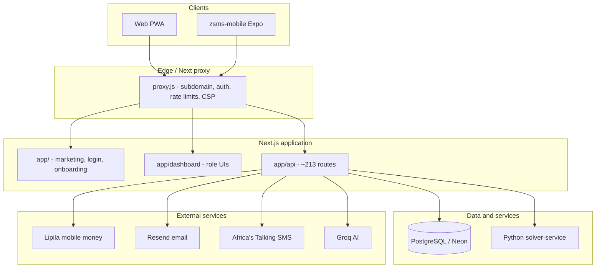

# Zambian School Management System (ZSMS) — Project Review

**Document version:** 1.0  
**Last updated:** May 2026  
**Application version:** 2.0.3 (`package.json`)  
**Repository:** `zambian-school-management-system` — Next.js monorepo + Expo mobile companion

This review summarizes what the project is, what has been built and fixed to date, how it is deployed, and where gaps remain. It consolidates information from `README.md`, `CHANGELOG.md`, `CAPABILITIES.md`, `docs/doc/COMPLETE_FEATURES_OUTLINE.md`, `memory/PRD.md`, and a full pass over the current codebase.

---

## 1. Executive summary

ZSMS is a **multi-tenant school management platform** aimed at Zambian primary and secondary schools. It combines:

- A **Next.js 16** web application (PWA-oriented) with role-based dashboards
- A **PostgreSQL** database via **Prisma** (~74 models)
- **~213 API route handlers** under `app/api/`
- Optional **Expo mobile app** (`zsms-mobile/`) for teacher attendance and sync
- Optional **Python timetable solver** (`solver-service/`) for advanced scheduling

Schools are isolated by `schoolId` and typically accessed via **per-school subdomains** (e.g. `https://{school}.bluepeacktechnologies.com`). The product supports **ECZ-aligned** teaching workflows, **mobile money billing** (Lipila), **email onboarding** (Resend), and **SMS** (Africa’s Talking).

The codebase is **feature-rich and production-oriented**, with ongoing hardening around payments, tenancy, and deployment. Documentation in `docs/doc/` is partly legacy (Laravel/Cloudflare references); **root `README.md`, `proxy.js`, and `prisma/schema.prisma` are the best sources of truth for the live stack.**

---

## 2. Technology stack

| Layer            | Technology                                  | Notes                                                          |
| ---------------- | ------------------------------------------- | -------------------------------------------------------------- |
| Framework        | Next.js 16 (App Router)                     | `app/` pages + API routes                                      |
| UI               | React 19, Tailwind CSS, Lucide              | Royal purple theme, glassmorphism                              |
| State            | Zustand (auth), TanStack Query              | Session sync, dashboard data                                   |
| Database         | PostgreSQL + Prisma 6                       | Neon adapter in production                                     |
| Auth             | JWT (HTTP-only cookies + refresh)           | Role-based access via `lib/middleware/auth`                    |
| Email            | Resend                                      | Verification, portal links, password reset                     |
| Payments         | Lipila                                      | MTN / Airtel / Zamtel mobile money                             |
| SMS              | Africa’s Talking                            | Outbound + inbound webhooks                                    |
| AI               | Groq + Vercel AI SDK (`ai`, `@ai-sdk/groq`) | Structured outputs via Zod; see `docs/AI_GUIDE.md`             |
| PWA              | Workbox, service worker                     | Offline-oriented design goals                                  |
| Mobile           | Expo 52 (`zsms-mobile/`)                    | Attendance, face/twin-pin, API sync                            |
| Timetable solver | TS greedy solver + Python service           | Docker on port 8001                                            |
| Quality          | ESLint 9, Prettier, Husky, Vitest + Jest    | Critical API paths covered; broader API coverage still growing |
| Observability    | `@sentry/nextjs` (dependency)               | Wiring may be minimal                                          |

---

## 3. Architecture overview



### Multi-tenancy

- Every school has a `School` record with `subdomain`, `plan`, trial/expiry fields.
- `lib/utils/getSchoolId.js` resolves tenant from host / `x-school-subdomain` (set by `proxy.js`).
- API and UI data are scoped by `schoolId`; platform admins use a separate `app/platform/` area.

### Security edge (`proxy.js`)

- Protects `/dashboard` and most `/api` routes.
- Public allowlist for auth, onboarding, Lipila callbacks, health, public marketing APIs.
- CORS, rate limiting (`lib/security/proxyRateLimit.js`), security headers.
- Deprecated `/api/v1/*` routes receive deprecation headers.

---

## 4. User roles and dashboards

| Role                    | Primary responsibilities                                        | Dashboard area               |
| ----------------------- | --------------------------------------------------------------- | ---------------------------- |
| **Headteacher / Admin** | School-wide ops, users, timetable publish, MOE reports, billing | `app/dashboard/headteacher/` |
| **HOD**                 | Department, allocations, lesson plan review, staff oversight    | `app/dashboard/hod/`         |
| **Teacher**             | Classes, attendance, assessments, lesson plans, results         | `app/dashboard/teacher/`     |
| **Student**             | Subjects, assessments, results, learning tools, ECZ practice    | `app/dashboard/student/`     |
| **Platform admin**      | Cross-school management                                         | `app/platform/`              |

Shared modules include timetable, billing, payments, SMS, attendance, assessments, materials, SDG views, and profile/settings.

---

## 5. What has been achieved (by domain)

### 5.1 School registration and onboarding

| Capability                                   | Status | Implementation                                                   |
| -------------------------------------------- | ------ | ---------------------------------------------------------------- |
| Email + password signup                      | Done   | `POST /api/onboarding/start`                                     |
| Email verification                           | Done   | Resend + `GET /api/onboarding/verify/[token]`                    |
| **Free trial (30 days)**                     | Done   | `POST /api/onboarding/select-plan` with `plan: trial`; no Lipila |
| Paid plans (Basic / Standard / Premium)      | Done   | K500 / K800 / K1200 per month via Lipila                         |
| Mobile money payment (MTN, Airtel, Zamtel)   | Done   | `lib/payments/lipila.js`, `POST /api/onboarding/pay`             |
| Lipila webhook                               | Done   | `POST /api/onboarding/lipila/callback`                           |
| Portal creation after verify + payment/trial | Done   | `POST /api/onboarding/complete` → School + headteacher user      |
| Legacy direct school register                | Gated  | `ALLOW_DIRECT_SCHOOL_REGISTRATION=true` only                     |
| Public register-school entry                 | Done   | Redirects to `/onboarding`                                       |

**Recent hardening (May 2026):**

- Removed **auto-mark-as-paid** when `LIPILA_API_KEY` is missing (was blocking real PIN prompts and allowing skip).
- Removed **URL bypass** (`?step=setup` no longer unlocks portal without `paid` or trial).
- Removed **insecure manual “Confirm Payment”** that marked paid without Lipila verification.
- Status API syncs with Lipila `check-status` via `?syncPayment=1`; UI polls while payment is pending.
- Corrected Lipila `paymentType` values (`MtnMoney`, `AirtelMoney`, `ZamtelKwacha`).
- Provider logos try `png` → `jpg` → … under `public/payments/` (`mtn.jpg`, `airtel.jpg`, `zamtel.png`).

### 5.2 Authentication and users

- JWT login/logout/refresh, `GET /api/auth/me`
- Password reset via Resend
- Headteacher-led user registration (`/admin/registration`, `POST /api/auth/register`)
- Mobile auth: `POST /api/mobile/auth/login`, refresh, sync
- Subscription gate for expired trials/plans (`lib/middleware/subscriptionGate.js`, billing dashboard)

### 5.3 Academics and ECZ

- Subjects catalog with auto-seed per school (~29 subjects, local languages)
- Classes, departments, teaching assignments
- Assessments, SBA tasks/scores, question bank
- **ECZ submissions**, evidence uploads, accommodations, rubric builder
- Student ECZ practice and teacher ECZ tooling
- Results export and analytics

### 5.4 Timetable (major 2026 milestone)

Documented in `docs/doc/COMPLETE_FEATURES_OUTLINE.md` (April 2026):

- HOD allocations → push to headteacher → approval workflow
- Master timetable generation (greedy/backtracking TS solver + optional Python service)
- Draft vs published timetables, term/academic year awareness
- Drag/drop edits, notifications when HOD pushes allocations
- Role-specific timetable views (headteacher, HOD, teacher, student)

### 5.5 Lesson plans and AI teaching tools

- Lesson plan CRUD, HOD approval, comments, export
- AI tools (Groq): lesson planner, story weaver, quiz maker, report comments, ECZ practice papers
- Creative features, whiteboard (Excalidraw), virtual lab, games, code playground (student)
- Usage/plan restrictions where configured

### 5.6 Attendance

- Web attendance stats
- **Mobile-first sessions**: open/close, marks, face verification, twin-pin (`zsms-mobile` + `app/api/mobile/attendance/*`)
- Headteacher chronic absentee tracking

### 5.7 Communications and billing

- SMS send + inbound/delivery webhooks
- School billing page, Lipila mobile money for in-app payments
- Welcome SMS on onboarding complete (optional)
- MOE reports, STEM monitoring, exam tracking (headteacher)

### 5.8 Platform and administration

- Platform super-admin login and school listing
- Admin allocation approve/reject, repair utilities, master timetable tools
- Feature access checks (`/api/features/check-access`)
- Public marketing APIs (school lookup, platform stats, contact)

### 5.9 UI/UX and quality (CHANGELOG 2.1.0–2.2.0)

- **Vitest** — 27 critical-path API tests (auth login, onboarding payment gate, SBA, ECZ submissions); see `docs/TESTING.md`
- Jest + React Testing Library (auth UI, payment helpers, forms, Zambia features) — `npm run test:jest`
- ESLint, Prettier, Husky, lint-staged
- Mobile-responsive results and timetable layouts
- Next.js `Image` optimization, accessibility touch targets
- SEO metadata, sitemap, robots.txt
- Lazy-loaded dashboard chunks

### 5.10 Bug fixes and polish (documented / recent)

| Issue                                                                  | Resolution                                                         |
| ---------------------------------------------------------------------- | ------------------------------------------------------------------ |
| Hardcoded headteacher name “Brian B. Zulu” on registration status card | Now shows logged-in `user.name` (`app/admin/registration/page.js`) |
| Payment logos not loading (`.png` vs `.jpg`)                           | Extension fallback chain in `lib/payments/provider-logos.js`       |
| Onboarding payment bypass and missing PIN prompt                       | Lipila gating and sync (see §5.1)                                  |
| Teaching assignments 403 (TS vs JS route roles)                        | Aligned role checks (`TODO.md`)                                    |
| Student subjects not displaying                                        | Multi-source enrollment check (executive summary)                  |
| Subject seeding on empty schools                                       | `GET /api/subjects` seeds when count is zero                       |
| Timetable production 500s from schema drift                            | Migrations on deploy (`prisma:migrate:deploy`, `vercel-build.js`)  |

---

## 6. API surface (summary)

Approximately **213** route files under `app/api/`, grouped as:

- **Auth & account** — login, register, refresh, profile, password
- **Onboarding & schools** — start, verify, pay, complete, Lipila callback, subdomain check
- **Dashboard** — per-role aggregates (headteacher, HOD, teacher, student)
- **Timetable** — entries, config, periods, allocations, publish, solver generate
- **Mobile** — auth, sync, roster, attendance sessions
- **ECZ & assessments** — submissions, scores, evidence, rubrics, accommodations
- **Lesson plans & AI** — CRUD, generate, HOD queue
- **Payments & SMS** — mobile-money, Lipila callback, send/inbound
- **Platform & admin** — schools, allocations, repair, exports
- **Public** — school directory, features, contact, feedback

Full catalogs are maintained in `README.md` and `API_DOCS.md`.

---

## 7. Mobile application (`zsms-mobile/`)

- **Expo / React Native** teacher companion
- Login against school subdomain API
- Attendance sessions with offline-oriented sync patterns
- Face enrollment / twin-pin verification flows
- Documented in `docs/doc/mobile-app.md` and `zsms-mobile/README.md`

The web app remains the primary admin and student surface; mobile targets field attendance use cases.

---

## 8. Database and seeds

- **Prisma schema:** ~74 models (schools, users, profiles, timetable, ECZ, assessments, registrations, etc.)
- **Seed scripts:** `npm run seed`, `seed:local`, `seed:schools`, `seed:st-marys`, `seed:platform-admin`, `seed:ndake-premium-trial`, `seed:timeslots`
- **Migrations:** `prisma/migrations/`; deploy path uses `DIRECT_URL` on Neon

---

## 9. Deployment and operations

| Target                           | Status                                                 |
| -------------------------------- | ------------------------------------------------------ |
| **Vercel + Neon PostgreSQL**     | Recommended (`docs/doc/DEPLOY.md`, `VERCEL_DEPLOY.md`) |
| **Docker Compose**               | Postgres + web + solver (`docker-compose.yml`)         |
| **Cloudflare Workers / Railway** | Documented as deprecated; migrated toward Vercel       |
| **Custom server**                | `server.js` for `0.0.0.0` binding in containers        |

**Required production env (non-exhaustive):**

- `DATABASE_URL`, `DIRECT_URL`
- `JWT_SECRET` / session secrets
- `RESEND_API_KEY`, `EMAIL_FROM`
- `LIPILA_API_KEY`, optional `LIPILA_BASE_URL`
- `AFRICASTALKING_*` for SMS
- `GROQ_API_KEY` for AI features
- `COOKIE_DOMAIN`, `APP_BASE_DOMAIN` / `BASE_DOMAIN` for subdomains

Lipila **callback URL** must be publicly reachable, e.g.  
`https://{your-domain}/api/onboarding/lipila/callback`

---

## 10. Testing and code quality

| Area                     | Status                                                                                    |
| ------------------------ | ----------------------------------------------------------------------------------------- |
| API route tests (Vitest) | **4** suites / **27** tests in `__tests__/api/` — login, onboarding/Lipila, SBA, ECZ      |
| Component tests (Jest)   | Legacy files in `__tests__/` (auth UI, payment, forms, Zambia features)                   |
| Lint                     | ESLint on `app`, `components`, `lib`, `proxy.js`                                          |
| Format                   | Prettier + lint-staged on commit                                                          |
| Coverage vs routes       | Critical paths covered; **~213** API handlers overall — expand tests when touching routes |

See `docs/TESTING.md`, `CODE_QUALITY.md`, `PERFORMANCE.md`, `SECURITY_AUDIT.md`.

---

## 11. Documentation map

| Document                                  | Purpose                                                 |
| ----------------------------------------- | ------------------------------------------------------- |
| `README.md`                               | Primary technical reference, API/page catalogs          |
| `review.md`                               | **This file** — holistic project review                 |
| `CAPABILITIES.md`                         | Feature marketing-style capability list                 |
| `CHANGELOG.md`                            | Release notes (through 2.2.0 PRD tasks)                 |
| `docs/TESTING.md`                         | Vitest/Jest commands, mocks, coverage targets           |
| `docs/AI_GUIDE.md`                        | Groq AI layer, schemas, adding features                 |
| `docs/ECZ_COMPLIANCE.md`                  | ECZ SBA rules, model mapping, seed data                 |
| `docs/SMS_GUIDE.md`                       | Africa's Talking setup, templates, phone formats        |
| `docs/QR_ATTENDANCE.md`                   | QR attendance flow, JWT security, teacher/student steps |
| `API_DOCS.md`                             | API reference                                           |
| `docs/doc/COMPLETE_FEATURES_OUTLINE.md`   | Role-by-role feature inventory                          |
| `docs/doc/DEPLOY.md` / `VERCEL_DEPLOY.md` | Deployment                                              |
| `docs/doc/SETUP_GUIDE.md`                 | Local setup                                             |
| `TODO.md`                                 | Completed troubleshooting notes                         |
| `memory/PRD.md`                           | Product context and backlog                             |
| `public/payments/README.md`               | Mobile money logo assets                                |

**Stale docs warning:** `docs/doc/PROJECT_STRUCTURE.md` and parts of `docs/doc/README.md` still mention Laravel or Cloudflare-first deploys. Prefer this review and root `README.md` for current architecture.

---

## 12. Strengths

1. **Breadth** — Covers registration → academics → timetable → ECZ → billing in one monorepo.
2. **Zambia-specific** — Local languages, mobile money, ECZ alignment, rural/PWA narrative.
3. **Multi-tenant readiness** — Subdomain proxy, school scoping, platform admin layer.
4. **Real payment integration** — Lipila collections with webhook + status sync (post-hardening).
5. **Timetable workflow** — End-to-end HOD → headteacher → publish pipeline.
6. **Mobile attendance path** — Dedicated API + Expo app for on-the-ground use.
7. **Operational scripts** — Seeds, Docker, Vercel build with migration fallback.

---

## 13. Gaps, risks, and recommendations

### High priority

1. **Expand automated tests** — Critical paths: onboarding (trial + paid), Lipila callbacks, `onboarding/complete` payment gate, auth, timetable publish.
2. **Confirm Lipila in production** — `LIPILA_API_KEY` set; callback URL whitelisted; no bot protection on server-to-server Lipila calls.
3. **Consolidate duplicate API routes** — Some endpoints exist as both `.js` and `.ts` (e.g. teaching-assignments); risks 403/behavior drift.
4. **Align documentation** — Update or archive Laravel/Cloudflare docs to reduce onboarding confusion for new developers.

### Medium priority

5. **Sentry / logging** — Wire `@sentry/nextjs` or structured logging for production errors (Prisma codes already surfaced in places).
6. **ECZ data model** — `docs/doc/update.md` notes question-bank vs `game` model; continue ECZ schema normalization if compliance is a goal.
7. **Payment UX** — Clear failure messages from Lipila (`failed` status) on onboarding; retry flow.
8. **API versioning** — `/api/v1` deprecated; plan removal or migration doc for any external clients.

### Lower priority

9. **README stack version** — README still says React 18; package.json uses React 19 / Next 16.
10. **Feature scope vs maintenance** — Large dashboard surface (games, 3D shapes, music, etc.) may need prioritization for rural MVP schools.

---

## 14. Suggested next milestones

1. **Production payment smoke test** — End-to-end onboarding on staging with real Lipila dev keys and PIN confirmation.
2. **Test suite for onboarding** — Mock Lipila; assert `complete` returns 402 until `paymentStatus === 'paid'`.
3. **Developer onboarding doc** — Single “start here” page replacing conflicting structure docs.
4. **Mobile app release checklist** — Store build, API base URL per school, token refresh QA.
5. **Timetable solver load test** — Large schools with Python service enabled in Docker/production.

---

## 15. How to run locally (quick reference)

```bash
npm install
npm run prisma:generate
# Set DATABASE_URL in .env / .env.local
npm run prisma:db:push   # or migrate
npm run seed:local         # optional dev data
npm run dev                # http://localhost:3000
```

Optional: `docker compose up` for Postgres + solver.  
See `README.md` and `docs/doc/SETUP_GUIDE.md` for full variable lists.

---

## 16. Changelog of this review document

| Date     | Change                                                                                                               |
| -------- | -------------------------------------------------------------------------------------------------------------------- |
| May 2026 | Initial `review.md` — codebase survey, achievements, payment/onboarding hardening, logo fix, headteacher display fix |
| May 2026 | PRD Task 1 — `lib/config/env.js`, `docs/ENVIRONMENT.md`, enhanced `/api/health` (see `CHANGELOG.md` 2.2.0)           |
| May 2026 | PRD Task 2 — Sentry wiring, structured `lib/utils/logger.js`, `docs/DEVELOPER_GUIDE.md`                              |

---

_Maintainers: update this file when major features ship or when deployment/payment behavior changes. Link PRs or `CHANGELOG.md` entries in §5 when closing significant gaps._
